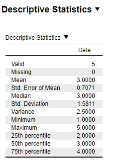
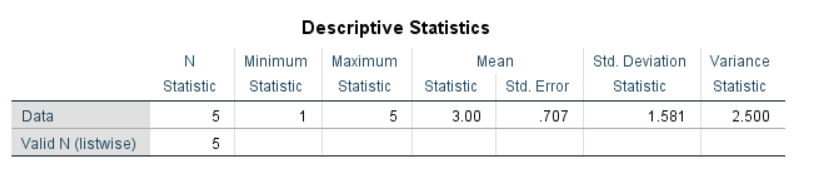
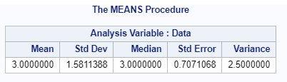

---
output:
  word_document: default
  html_document: default
---
# Descriptives

## Descriptives

An example from Kerlinger (1969, pp. 93-95):


```{r echo=F}
desc.data <- data.frame("Data" = c(1:5))
knitr::kable(head(desc.data, 20), caption = "Data for Descriptives", booktabs = T)
```

### Results Overview {#ResultsDesc}

```{r echo=F}
ResultsDesc <- matrix(c(rep(3,6),
                        rep(2.5,6),
                       NA,rep(3,5),
                       NA,rep(1.58,5),
                       NA, rep(0.707, 5)), ncol=6, byrow = T)
colnames(ResultsDesc) <- c('By Hand', 'JASP', 'SPSS', 'SAS', 'Minitab', 'R')
rownames(ResultsDesc) <- c('Mean', 'Variance', 'Median', 'Standard Deviation', 'SE(Mean)' )
knitr::kable(head(ResultsDesc, 20), caption = "Result Overview Descriptives", booktabs = T)
```

### By Hand {#ByHandDesc}

Calculations by hand can be found in Kerlinger (1969, pp. 93-95).

Result: 

Mean = 3

Variance = 2.5

**Note**: Kerlinger calculated the population variance, however as all statistical software computes the sample variance, the formula was adapted accordingly to be divided by N-1.


### JASP {#jaspDesc}


```{r descJASP, echo=FALSE, fig.cap="\\label{fig:descJASP}JASP Output for Descriptives"}

```


### SPSS {#spssDesc}

```{r eval=F}
DATASET ACTIVATE DataSet1.
DESCRIPTIVES VARIABLES=Data
  /STATISTICS=MEAN STDDEV VARIANCE MIN MAX SEMEAN.
```


```{r descSPSS, echo=FALSE, fig.cap="\\label{fig:descSPSS}SPSS Output for Descriptives"}

```


### SAS {#sasDesc}

```{r eval=F}
PROC MEANS DATA=work.Desc Mean STDDEV Median STDERR Var;
  VAR Data;
RUN;
```


```{r descSAS, echo=FALSE, fig.cap="\\label{fig:descSAS}SAS Output for Descriptives"}

```


### Minitab {#minitabDesc}

```{r descMinitab, echo=FALSE, fig.cap="\\label{fig:descMinitb}Minitab Output for Descriptives"}
knitr::include_graphics('Screenshots/Descriptives/DescriptivesMinitab.PNG')
```


### R {#rDesc}
```{r echo=F}
desc.data2 <- read.csv("Datasets/Descriptives.csv", sep=",")
```


```{r}
mean(desc.data2$Data)
sd(desc.data2$Data)
var(desc.data2$Data)
median(desc.data2$Data)
se <- function(x) sqrt(var(x)/length(x))
se(desc.data2$Data)

```


### Remarks {#remarksDesc}

All differences in results between the software and hand calculation are due to rounding.


### References {#refDesc}
Kerlinger, F. N. (1969). *Foundations of behavioral research*. New York, US: Holt, Rinehart and Winston, Inc.
