# T-Tests


## Independent Samples T-Test 

An example from Hays (1974, pp. 404-407):

"An experimenter working in the area of motivational factors in perception was interested in the effects of deprivation upon the perceived size of objects. Among the studies carried out was one done with orphans, who were compared with nonorphaned children on the basis of the judged size of parental figures viewed at a distance. [...]Now two independent randomly selected groups were used. Sample 1 was a group of orphaned children without foster parents. Sample 2 was a group of children having a normal family with both parents. Both population of children sampled showed the same age level, sex distribution, educational level, and so forth. The question asked by the experimenter was 'Do deprived children tend to judge the parental figures relatively larger than do the nondeprived?' In terms of a null and alternative hypothesis,

H~0~: $\mu$~1~ - $\mu$~2~ $\le 0$

H~1~: $\mu$~1~ - $\mu$~2~ $> 0$.

The $\alpha$ level for significance decided upon was .05. The actual results were

*Sample 1:*

M~1~ = 1.8

~S1~ = .7  

N~1~ = 125                          

*Sample 2:*

M~2~ = 1.6

~S2~ = .9

N~2~ = 150"

**Note**: A data set with these properties has been simulated using R.

### Results Overview {#ResultsISTT}

```{r echo=F}
ResultsISTT <- matrix(c(2.11, 2.0717, 2.072, 2.07, 2.07, 2.0717
                        , NA, 2.0257, 2.026, 2.03, 2.03, 2.0257), ncol=6, byrow = T)
colnames(ResultsISTT) <- c('By Hand', 'JASP', 'SPSS', 'SAS', 'Minitab', 'R')
rownames(ResultsISTT) <- c('t (Welch)', 't (Student)')
knitr::kable(head(ResultsISTT, 20), caption = "Result Overview Independent Samples T-Test", booktabs = T)
```

### By Hand {#ByHandISTT}

Calculations by hand can be found in Hays, 1974, pp. 404-407.

Result: t = 2.11

Significant (two-tailed test) for $\alpha$ = .05 or less

**Note:** Hays calculated only the Welch T-test.

### JASP {#jaspISTT}


```{r isttJASP, echo=FALSE, fig.cap="\\label{fig:isttJASP}JASP Output for Independent Samples T-Test"}
knitr::include_graphics('Screenshots/Independent Samples T test/isttJASP.PNG')
```

### SPSS {#spssISTT}

```{r eval=F}
DATASET ACTIVATE DataSet1.
T-TEST GROUPS=groups(1 2)
  /MISSING=ANALYSIS
  /VARIABLES=samples
  /CRITERIA=CI(.95).
```


```{r isttSPSS, echo=FALSE, fig.cap="\\label{fig:isttSPSS}SPSS Output for Independent Samples T-Test"}
knitr::include_graphics('Screenshots/Independent Samples T test/isttSPSS.PNG')
```

### SAS {#sasISTT}

```{r eval=F}
proc ttest data=istt sides=2 alpha=0.05 h0=0;
 	title "Two sample t-test";
 	class Group; 
	var Score;
   run;
```


```{r isttSAS, echo=FALSE, fig.cap="\\label{fig:isttSAS}SAS Output for Independent Samples T-Test"}
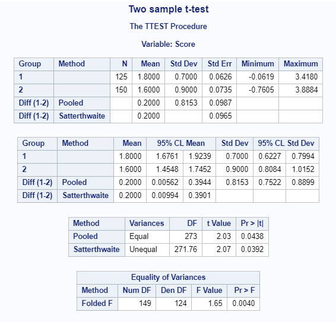
```

### Minitab  {#minitabISTT}

```{r isttMinitab, echo=FALSE, fig.cap="\\label{fig:isttMinitab}Minitab Output for Welch Independent Samples T-Test"}
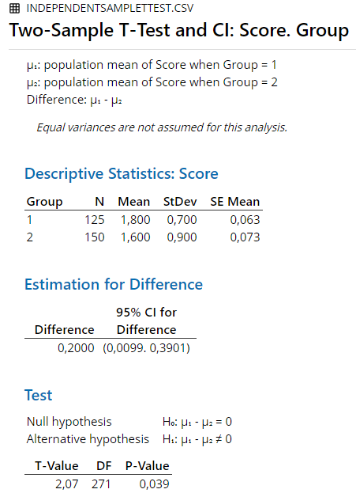
```

```{r isttMinitab2, echo=FALSE, fig.cap="\\label{fig:isttMinitab2}Minitab Output for Student Independent Samples T-Test"}
knitr::include_graphics('Screenshots/Independent Samples T test/isttMinitab2.PNG')
```

### R {#rISTT}
```{r echo=F}
istt.data <- read.csv("Datasets/IndependentSamplettest.csv", sep=",")
istt.data$Group <-as.factor(istt.data$Group)
```


```{r}
t.test(subset(istt.data, Group == 1)$Score, subset(istt.data, Group == 2)$Score)
```

```{r}
t.test(subset(istt.data, Group == 1)$Score, subset(istt.data, Group == 2)$Score, var.equal = T)
```
### Remarks {#remarksISTT}

All differences in results between the software and hand calculation are due to rounding.


### References {#refISTT}

Hays, W. L. (1974). *Statistics for the social sciences (2nd Ed.)*. New York, US: Holt, Rinehart and Winston, Inc.


## Mann-Whitney Test 

An example from Hays (1974, pp. 778-780):

"As an example, consider the following data:"

```{r echo=F}
MWT.data <- data.frame(Score = c(8,3,4,6,1,7,9,10,12), Group = c(rep('A', 4), rep('B', 5)))
knitr::kable(head(MWT.data, 20), caption = "Data for Mann-Whitney Test", booktabs = T)
```

### Results Overview {#ResultsMWT}

```{r echo=F}
ResultsMWT <- matrix(c(5, 5, 5, 5, 5, 5), ncol=6)
colnames(ResultsMWT) <- c('By Hand', 'JASP', 'SPSS', 'SAS', 'Minitab', 'R')
rownames(ResultsMWT) <- "U'"
knitr::kable(head(ResultsMWT, 20), caption = "Result Overview Mann-Whitney Test", booktabs = T)
```

### By Hand {#ByHandMWT}

Calculations by hand can be found in Hays, 1974, pp. 778-780.

Result: 

U' = 5

U  = 15

Not significant for $\alpha$ = .05 or less.


### JASP {#jaspMWT}


```{r mwtJASP, echo=FALSE, fig.cap="\\label{fig:mwtJASP}JASP Output for Mann-Whitney Test"}
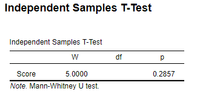
```
**Note:** W corresponds to U' in the hand calculation.


### SPSS {#spssMWT}

```{r eval=F}
DATASET ACTIVATE DataSet1.
*Nonparametric Tests: Independent Samples. 
NPTESTS 
  /INDEPENDENT TEST (Score) GROUP (Group) MANN_WHITNEY 
  /MISSING SCOPE=ANALYSIS USERMISSING=EXCLUDE
  /CRITERIA ALPHA=0.05  CILEVEL=95.

```


```{r mwtSPSS, echo=FALSE, fig.cap="\\label{fig:mwtSPSS}SPSS Output for Mann-Whitney Test"}
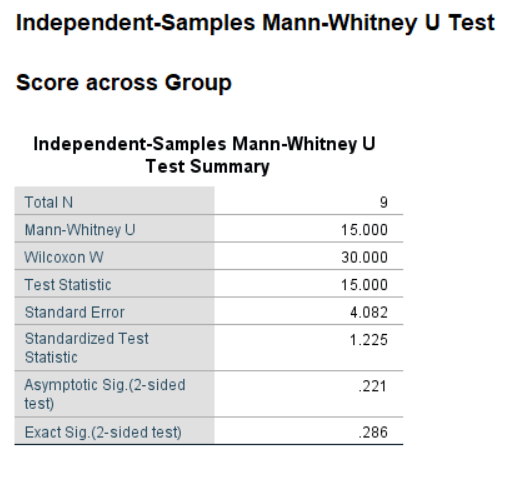
```

**Note:** U = 15 corresponds to U' = 5.

### SAS {#sasMWT}

```{r eval=F}
PROC npar1way data=work.mwt wilcoxon;
class Group;
var Score;
run;
```


```{r mwtSAS, echo=FALSE, fig.cap="\\label{fig:mwtSAS}SAS Output for Mann-Whitney Test"}
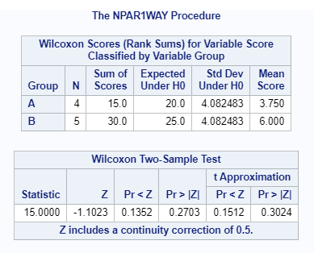
```

**Note:** U = 15 corresponds to U' = 5.

### Minitab {#minitabMWT}

```{r mwtMinitab, echo=FALSE, fig.cap="\\label{fig:mwtMinitab}Minitab Output for Mann-Whitney Test"}
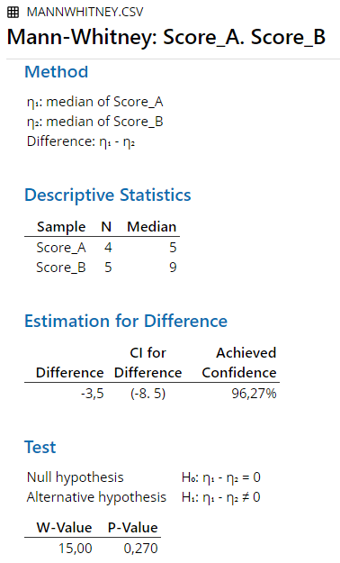
```

**Note:** W corresponds to U in the hand calculation and U = 15 corresponds to U' = 5.


### R {#rMWT}
```{r echo=F}
MWT.data2 <- read.csv("Datasets/MannWhitney.csv", sep=",")
```


```{r}
wilcox.test(Score~Group, data = MWT.data2)
```
**Note:** W corresponds to U' in the hand calculation.


### Remarks {#remarksMWT}

All differences in results between the software and hand calculation are due to rounding.

The output for the Mann-Whitney test is not clearly defined, leading to different conventions in different software. The R documentation explains it as follows:

"The two most common definitions correspond to the sum of the ranks of the first sample with the minimum value subtracted or not: R subtracts and S-PLUS does not, giving a value which is larger by m(m+1)/2 for a first sample of size m. (It seems Wilcoxon's original paper used the unadjusted sum of the ranks but subsequent tables subtracted the minimum.) R's value can also be computed as the number of all pairs (x[i], y[j]) for which y[j] is not greater than x[i], the most common definition of the Mann-Whitney test."


### References {#refMWT}

Hays, W. L. (1974). *Statistics for the social sciences (2nd Ed.)*. New York, US: Holt, Rinehart and Winston, Inc.


## Paired Samples T-Test 

An example from Hays (1974, pp. 424-427):

"Consider once again the question of scores on a test of dominance. The basic question has to do with the mean score for men as opposed to the mean score for women. In carrying out the experiment, the investigator decided to sample eight husband-wife-pairs at random. The members of each pair were given the test of dominance separately, and the data turned out as follows:"

```{r echo=F}
pstt.data <- data.frame(Husband=c(26,28,28,29,30,31,34,37), Wife=c(30,29,28,27,26,25,24,23))
knitr::kable(head(pstt.data, 20), caption = "Data for Paired Sample T-Test", booktabs = T)
```


### Results Overview {#ResultsPSTT}

```{r echo=F}
ResultsPSTT <- matrix(c(1.838, 1.8381, 1.838, 1.84, 1.84, 1.8381), ncol=6)
colnames(ResultsPSTT) <- c('By Hand', 'JASP', 'SPSS', 'SAS', 'Minitab', 'R')
rownames(ResultsPSTT) <- c('t')
knitr::kable(head(ResultsPSTT, 20), caption = "Result Overview Paired Samples T-Test", booktabs = T)
```


### By Hand {#ByHandPSTT}

Calculations by hand can be found in Hays, 1974, pp. 424-427.

Result: t = 1.838

Not significant (two-tailed test) for $\alpha$ = .05 or less.

### JASP {#jaspPSTT}

```{r psttJASP, echo=FALSE, fig.cap="\\label{fig:psttJASP}JASP Output for Paired Samples T-Test"}
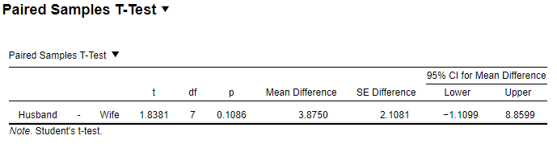
```
### SPSS {#spssPSTT}

```{r eval=F}
DATASET ACTIVATE DataSet1.
T-TEST PAIRS=Husband WITH Wife (PAIRED)
  /CRITERIA=CI(.9500)
  /MISSING=ANALYSIS.

```

```{r psttSPSS, echo=FALSE, fig.cap="\\label{fig:psttSPSS}SPSS Output for Paired Samples T-Test"}
knitr::include_graphics('Screenshots/Paired Samples T test/psttSPSS.PNG')
```

### SAS {#sasPSTT}

```{r eval=F}
proc ttest data=pstt sides=2 alpha=0.05 h0=0;
title "Paired sample t-test";
paired Husband * Wife;
run;
```

```{r psttSAS, echo=FALSE, fig.cap="\\label{fig:psttSAS}SAS Output for Paired Samples T-Test"}
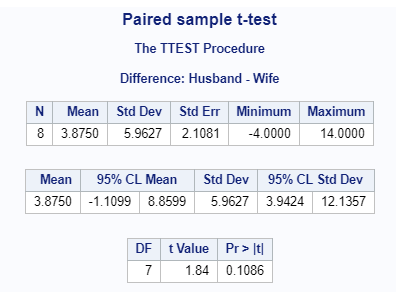
```


### Minitab {#minitabPSTT}

```{r psttMinitab, echo=FALSE, fig.cap="\\label{fig:psttMinitab}Minitab Output for Paired Samples T-Test"}
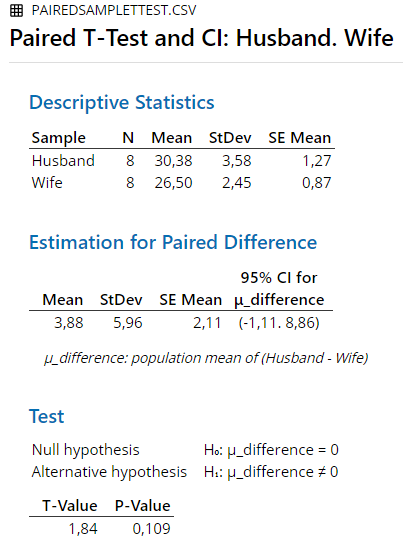
```

### R {#rPSTT}

```{r echo = F}
pstt.data <- read.csv("Datasets/Pairedsamplettest.csv", sep=",")
```

```{r}
t.test(pstt.data$Husband, pstt.data$Wife, paired = T)
```


### Remarks {#remarksPSTT}

All differences in results between the software and hand calculation are due to rounding.

### References {#refPSTT}

Hays, W. L. (1974). *Statistics for the social sciences (2nd Ed.)*. New York, US: Holt, Rinehart and Winston, Inc.


## Wilcoxon Test 


An example from Hays (1974, pp. 780-781):

"Suppose that in some experiment involving a single treatment and one control group, subjects were first matched pairwise, and then one member of each pair was assigned to the experimental group at random. In the experiment proper, each subject received some Y score."

```{r echo=F}
Wilcoxon.data <- data.frame("Treatment " = c(83,80,81,74,79,78,72,84,85,88), "Control" = c(75,78,66,77,80,68,75,90,81,83))
knitr::kable(head(Wilcoxon.data, 20), caption = "Data for Wilcoxon Test", booktabs = T)
```

### Results Overview {#ResultsWilcoxon}

```{r echo=F}
ResultsWilcoxon <- matrix(c(15, 15, 15, NA, 15, 15), ncol=6, byrow = T)
colnames(ResultsWilcoxon) <- c('By Hand', 'JASP', 'SPSS', 'SAS', 'Minitab', 'R')
rownames(ResultsWilcoxon) <- "W'"
knitr::kable(head(ResultsWilcoxon, 20), caption = "Result Overview Wilcoxon Test", booktabs = T)
```

### By Hand {#ByHandWilcoxon}

Calculations by hand can be found in Hays, 1974, pp. 780-781.

Result: 

T = 15

Not significant for $\alpha$ = .05 or less.


### JASP {#jaspWilcoxon}


```{r WilcoxonJASP, echo=FALSE, fig.cap="\\label{fig:WilcoxonJASP}JASP Output for Wilcoxon Test"}
knitr::include_graphics('Screenshots/Wilcoxon Test/WilcoxonJASP.PNG')
```


### SPSS {#spssWilcoxon}

```{r eval=F}
DATASET ACTIVATE DataSet1.
*Nonparametric Tests: Related Samples. 
NPTESTS 
  /RELATED TEST(Treatment Control) WILCOXON 
  /MISSING SCOPE=ANALYSIS USERMISSING=EXCLUDE
  /CRITERIA ALPHA=0.05  CILEVEL=95.

```


```{r WilcoxonSPSS, echo=FALSE, fig.cap="\\label{fig:WilcoxonSPSS}SPSS Output for Wilcoxon Test"}
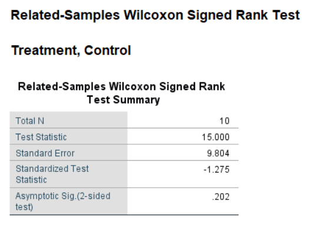
```

### SAS {#sasWilcoxon}

Not available in SAS.

### Minitab {#minitabWilcoxon}

```{r WilcoxonMinitab, echo=FALSE, fig.cap="\\label{fig:WilcoxonMinitab}Minitab Output for Wilcoxon Test"}
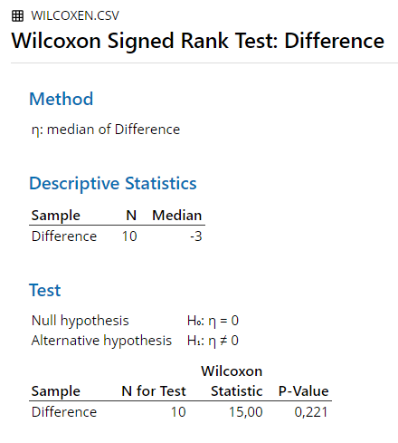
```


### R {#rWilcoxon}
```{r echo=F}
Wilcoxon.data2 <- read.csv("Datasets/Wilcoxon.csv", sep=",")
```


```{r}
wilcox.test(Wilcoxon.data2$Control, Wilcoxon.data2$Treatment., paired = T)
```


### Remarks {#remarksWilcoxon}

All differences in results between the software and hand calculation are due to rounding.


### References {#refWilcoxon}

Hays, W. L. (1974). *Statistics for the social sciences (2nd Ed.)*. New York, US: Holt, Rinehart and Winston, Inc.


## One Sample T-Test 

A dataset with the following properties has been generated using R:

n = 100

M = 5

$\sigma$ = 1

The expected mean to perform the One Sample T-test against is:

E(M) = 3

The  alpha level was chosen to be:

$\alpha$ = .05

### Results Overview {#ResultsOSTT}

```{r echo=F}
ResultsOSTT <- matrix(c(20, 20, 20, 20, 20, 20), ncol=6)
colnames(ResultsOSTT) <- c('By Hand', 'JASP', 'SPSS', 'SAS', 'Minitab', 'R')
rownames(ResultsOSTT) <- c('t')
knitr::kable(head(ResultsOSTT, 20), caption = "Result Overview One Sample T-Test", booktabs = T)
```


### By Hand {#ByHandOSTT}
t = $\frac{M - E(M) }{\sigma/\sqrt{n}}$

therefore:

t = $\frac{5-3}{1/\sqrt{100}}$ = $\frac{2}{1/10}$ = 20

A t-score of 20 is significant for a two tailed test at $\alpha$ = .05 or less.

### JASP {#jaspOSTT}

```{r osttJASP, echo=FALSE, fig.cap="\\label{fig:osttJASP}JASP Output for One Sample T-Test"}
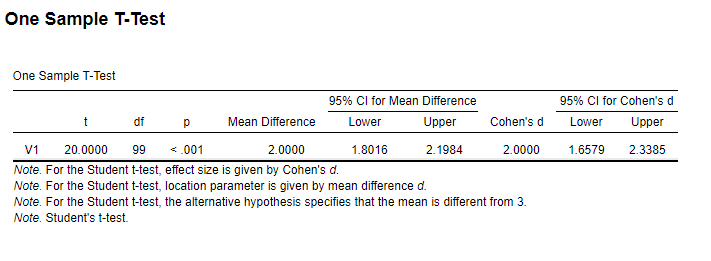
```
### SPSS {#spssOSTT}

```{r eval=F}
DATASET ACTIVATE DataSet1.
T-TEST
  /TESTVAL=3
  /MISSING=ANALYSIS
  /VARIABLES=V1
  /CRITERIA=CI(.95).
```

```{r osttSPSS, echo=FALSE, fig.cap="\\label{fig:osttSPSS}SPSS Output for One Sample T-Test"}
knitr::include_graphics('Screenshots/One Sample T test/osttSPSS.PNG')
```

### SAS {#sasOSTT}

```{r eval=F}
proc ttest data=work.OSTT sides=2 alpha=0.05  h0=3;
      var Data;
   run;
```

```{r osttSAS, echo=FALSE, fig.cap="\\label{fig:osttSAS}SAS Output for One Sample T-Test"}
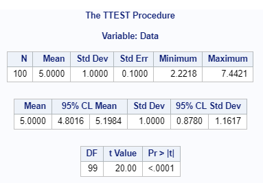
```


### Minitab {#minitabOSTT}

```{r osttMinitab, echo=FALSE, fig.cap="\\label{fig:osttMinitab}Minitab Output for One Sample T-Test"}
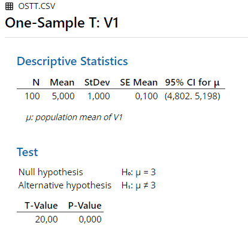
```

### R {#rOSTT}

```{r echo = F}
ostt.data2 <- read.csv("Datasets/OSTT.csv", sep=",")
```

```{r}
t.test(ostt.data2$V1, mu = 3)
```


### Remarks {#remarksOSTT}

All differences in results between the software and hand calculation are due to rounding.
