# ANOVA


## One-Way Independent ANOVA

An example from Hays (1974, pp. 476-478):

"An experiment was carried out to study the effect of a small lesion introduced into a particular structure in a rat's brain on his ability to perform in a discrimination problem. The particular structure studied is bilaterally symmetric. so that the lesion could be introduced into the structure on the right side of the brain, the left side, both sides, or neither side (a control group). Four groups of randomly selected rats were formed, and given the various treatments.[...] After a period of postoperative recovery, each rats was given the same series of discrimination problems. The dependent variable score was the average number of trials it took each rat to learn the task to some criterion level. The null hypothesis was that the four treatment populations of rats are identical in their average ability to learn this task:

H~0~: $\mu$~1~ = $\mu$~2~ = $\mu$~3~ = $\mu$~4~

as against the hypothesis that treatment differences exist:

H~1~: not H~0~.

The alpha level chosen for the experiment was .05."

```{r echo = F}
anova.data <- data.frame(Score = c(20, 18, 26, 19, 26, 24, 26, 24, 22, 25, 25, 20, 21, 34, 18, 32, 23, 22, 20, 22, 30, 27 ,22 ,24, 28, 21, 23, 25, 18, 30, 32, 27, 35, 18, 24, 28, 32, 16, 18, 25), Group = as.factor(c(rep(1, 7), rep(2, 11), rep(3, 13), rep(4,9))))
knitr::kable(head(anova.data, 91), caption = "Data for One-Way Independent ANOVA", booktabs = T)
```


### Results Overview {#ResultsAnova}

```{r echo=F}
ResultsANOVA <- matrix(c(7.5/24.4, 0.3082, 0.308, 0.31, 0.31, 0.308), ncol=6)
colnames(ResultsANOVA) <- c('By Hand', 'JASP', 'SPSS', 'SAS', 'Minitab', 'R')
rownames(ResultsANOVA) <- c('F')
knitr::kable(head(ResultsANOVA, 20), caption = "Result Overview One-Way Independent ANOVA", booktabs = T)
```

### By Hand {#ByHandAnova}

Calculations by hand can be found in Hays, 1974, pp. 476-478.

Results: 

```{r echo = F}
anova.results.hays <- data.frame(Source = c("Treatments (between groups)", "Error (within groups)", "Totals"), SS = c(22.6, 878.9, 901.5), df = c(3, 36, 39), MS = c(7.5, 24.4, NA), F = c(7.5/24.4, NA, NA))
knitr::kable(head(anova.results.hays, 20), caption = "Result from Hays (1974)", booktabs = T)
```

**Conclusion:** The null hypothesis cannot be rejected, because the critical F value was 2.84.

**Note**: Hays reported F =$\frac{7.5}{24.4}$. For a better comparison we transformed it to a decimal number.

### JASP {#jaspAnova}

```{r anovaJASP, echo=FALSE, fig.cap="\\label{fig:anovaJASP}JASP Output for One-Way Independent ANOVA"}
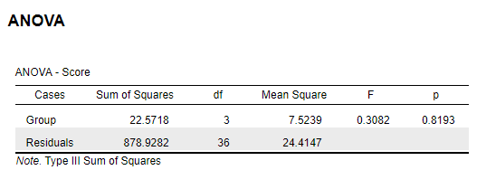
```

### SPSS {#spssAnova}

```{r eval=F}
DATASET ACTIVATE DataSet1.
ONEWAY Score BY Group
  /MISSING ANALYSIS.

```

```{r anovaSPSS, echo=FALSE, fig.cap="\\label{fig:anovaSPSS}SPSS Output for One-Way Independent ANOVA"}
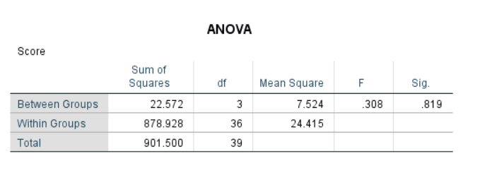
```

### SAS {#sasAnova}

```{r eval=F}
proc ANOVA data=anova;
	title One-way ANOVA;
	class Group;
	model Score = Group;
	means Group /hovtest welch;
	run;
```

```{r anovaSAS, echo=FALSE, fig.cap="\\label{fig:anovaSAS}SAS Output for One-Way Independent ANOVA"}
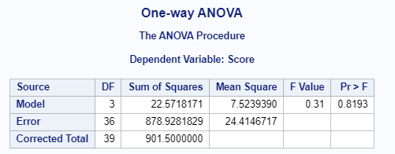
```

### Minitab {#minitabAnova}

```{r anovaMinitab, echo=FALSE, fig.cap="\\label{fig:anovaMinitab}Minitab Output for One-Way Independent ANOVA"}
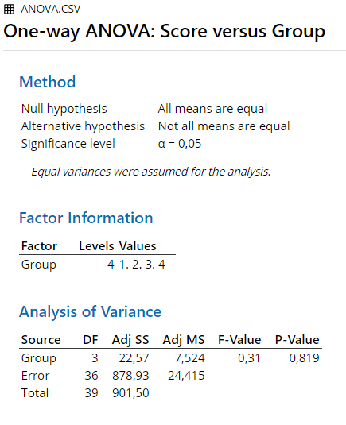
```

### R {#rAnova}

```{r}
## Compute the analysis of variance
results.anova <- aov(anova.data$Score ~ anova.data$Group, data = anova.data)
## Summary of the analysis
summary(results.anova)
```


### Remarks {#remarksAnova}


All differences in results between the software and hand calculation are due to rounding.


### References {#refAnova}

Hays, W. L. (1974). *Statistics for the social sciences (2nd Ed.)*. New York, US: Holt, Rinehart and Winston, Inc.


##  Factorial Independent ANOVA

An example from Hays (1974, pp. 491-493, 508-512):

"Just as before, the experimental game is under the control of the experimenter, so that each subject actually obtains the same score. After a fixed number of trials, during which the subject gets the preassigned score, he is asked to predict what his score will be on the next group of trials. Before he predicts, the subject is given 'information' about how this score compares with some norm group. In one experimental condition he is told that his performance is above average for the norm group, in the second condition he is told that his score is average, and in the third condition he is told that his score is below average for the norm group. Once again, there are three experimental treatments in terms of 'standings': 'above average', 'average', 'below average'. [...]One half of the subjects are told that they are being compared with college men, and the other half are told that they are being compared with professional athletes. Hence, there are two additional experimental treatments: 'college norms', and 'professional athlete norms'.

We wish to examine three null hypotheses:

(1) there is no effect of the standing given the subject[...]

(2) the actual norm group given the subjects has no effect [...]

(3) the norm-group-standing combination has no unique effect [...]

The $\alpha$ level chosen for each of these three tests will be .05."


```{r echo = F}
FIanova.data <- data.frame(Norms = c(rep('College men', 10), rep('Professional Athlete', 10)), Above = c(52, 48, 43, 50, 43, 44, 46, 46, 43, 49, 38, 42, 42, 35, 33, 38, 39, 34, 33, 34), Average = c(28, 35, 34, 32, 34, 27, 31, 27, 29, 25, 43, 34, 33, 42, 41, 37, 37, 40, 36, 35), Below= c(15, 14, 23, 21, 14, 20, 21, 16, 20, 14, 23, 25, 18, 26, 18, 26, 20, 19, 22, 17))
knitr::kable(head(FIanova.data, 91), caption = "Data for Factorial Independent ANOVA", booktabs = T)
```

N = 60

### Results Overview {#ResultsFIanova}

```{r echo=F}
ResultsFIANOVA <- matrix(c(0.35, 0.3582, 0.358, 0.36, 0.36, 0.358,
                           209.8, 209.6418, 209.642, 209.64, 209.64, 209.642,
                           34.0, 34.0075, 34.007, 34.01, 34.01, 34.007), ncol=6, byrow = T)
colnames(ResultsFIANOVA) <- c('By Hand', 'JASP', 'SPSS', 'SAS', 'Minitab', 'R')
rownames(ResultsFIANOVA) <- c('F (Norm groups)', 'F (Standings)', 'F (Interaction)')
knitr::kable(head(ResultsFIANOVA, 18), caption = "Result Overview Independent Factorial ANOVA", booktabs = T)
```

### By Hand {#ByHandFIanova}

Calculations by hand can be found in Hays, 1974, pp. 508-512.

Results: 

```{r echo = F}
FIanova.results.hays <- data.frame(Source = c("Rows (norm groups)", "Columns (standings)", "Interaction", "Error (within cells)"), SS = c(4.2, 4994.1, 810.2, 643.2), df = c(1,2,2,54), MS = c(4.2, 2497.05, 405.1, 11.9), F = c(.35, 209.8, 34.0, NA))
knitr::kable(head(FIanova.results.hays, 20), caption = "Result from Hays (1974)", booktabs = T)
```

**Conclusion:** The null hypothesis cannot be rejected, for the main effect of norm groups. It can be rejected for the main effect of standings and the interaction effect.


### JASP {#jaspFIanova}

```{r FIanovaJASP, echo=FALSE, fig.cap="\\label{fig:FIanovaJASP}JASP Output for Independent Factorial ANOVA"}
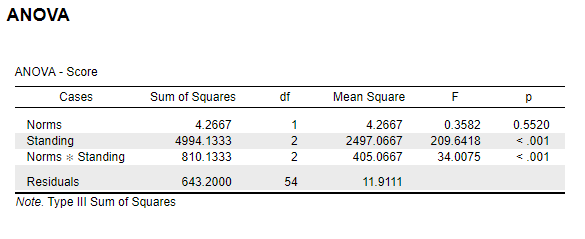
```

### SPSS {#spssFIanova}

```{r eval=F}
DATASET ACTIVATE DataSet1.
UNIANOVA Score BY Norms Standing
  /METHOD=SSTYPE(3)
  /INTERCEPT=EXCLUDE
  /CRITERIA=ALPHA(0.05)
  /DESIGN=Norms Standing Norms*Standing.

```

```{r FIanovaSPSS, echo=FALSE, fig.cap="\\label{fig:FIanovaSPSS}SPSS Output for Independent Factorial ANOVA"}
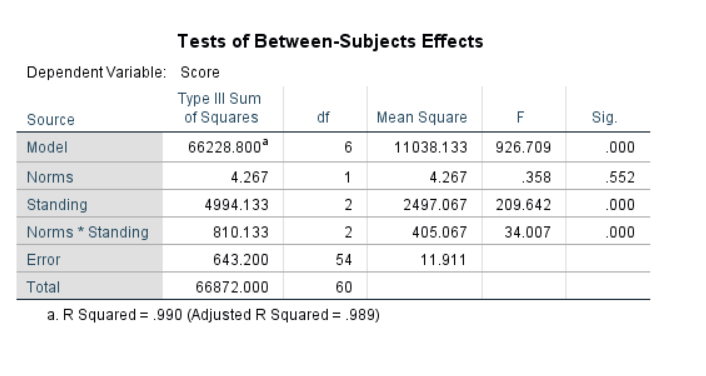
```

### SAS {#sasFIanova}

```{r eval=F}
proc anova data=FIanova;
      class Norms Standing;
	  model Score = Norms Standing Norms*Standing;
   run;
```

```{r FIanovaSAS, echo=FALSE, fig.cap="\\label{fig:FIanovaSAS}SAS Output for Independent Factorial ANOVA"}
knitr::include_graphics('Screenshots/Factorial Independent ANOVA/FIanovaSAS.PNG')
```

### Minitab {#minitabFIanova}

```{r FIanovaMinitab, echo=FALSE, fig.cap="\\label{fig:FIanovaMinitab}Minitab Output for Independent Factorial ANOVA"}
knitr::include_graphics('Screenshots/Factorial Independent ANOVA/FIanovaMinitab.PNG')
```

### R {#rFIanova}

```{r}
FIanova.data2 <- read.csv("Datasets/FIanova.csv", sep=",")
## Compute the analysis of variance
results.anova <- aov(FIanova.data2$Score ~ FIanova.data2$Standing * FIanova.data2$Norms, data = FIanova.data2)
## Summary of the analysis
summary(results.anova)
```


### Remarks {#remarksFIanova}


All differences in results between the software and hand calculation are due to rounding.


### References {#refFIanova}

Hays, W. L. (1974). *Statistics for the social sciences (2nd Ed.)*. New York, US: Holt, Rinehart and Winston, Inc.


## Kruskal-Wallis ANOVA


An example from Hays (1974, pp. 782-784):

"For example, suppose that three groups of small children were given the task of learning to discriminate between pairs of stimuli. Each child was given a series of pairs of stimuli, in which each pair differed in a variety of ways. However, attached to the choice of one member of a pair was a reward, and within an experimental condition, the cue for the rewarded stimulus was always the same. On the other hand, the experimental treatments themselves differed in the relevant cue for discrimination: in treatment I, the cue was form, in treatment II, color, and in treatment III, size. Some 36 children of the same sex and age were chosen at random and assigned at random to the three groups, with 12 children per group. The dependent variable was the number of trials to a fixed criterion of learning. Suppose that the data turned out the be as shown[...]"

```{r echo=F}
KWA.data <- data.frame("Treatment I" = c(6,11,12,20,24,21,18,15,14,10,8,14), "Treatment II" = c(31,7,9,11,16,19,17,11,22,23,27,26), "Treatment III" = c(13,32,31,30,28,29,25,26,26,27,26,19))
knitr::kable(head(KWA.data, 20), caption = "Data for Kruskal-Wallis ANOVA", booktabs = T)
```

### Results Overview {#ResultsKWA}

```{r echo=F}
ResultsKWA <- matrix(c(13.85, 13.8444, 13.844, 13.8444, 13.84, 13.844), ncol=6, byrow = T)
colnames(ResultsKWA) <- c('By Hand', 'JASP', 'SPSS', 'SAS', 'Minitab', 'R')
rownames(ResultsKWA) <- "H'"
knitr::kable(head(ResultsKWA, 20), caption = "Result Overview Kruskal-Wallis ANOVA", booktabs = T)
```

### By Hand {#ByHandKWA}

Calculations by hand can be found in Hays, 1974, pp. 782-784.

Result: 

H = 13.85

Significant for $\alpha$ = .01 or less.


### JASP {#jaspKWA}

```{r kwaJASP, echo=FALSE, fig.cap="\\label{fig:kwaJASP}JASP Output for Kruskal-Wallis ANOVA"}
knitr::include_graphics('Screenshots/Kruskal-Wallis ANOVA/kwaJASP.PNG')
```


### SPSS {#spssKWA}

```{r eval=F}
DATASET ACTIVATE DataSet1.
*Nonparametric Tests: Independent Samples. 
NPTESTS 
  /INDEPENDENT TEST (Score) GROUP (Treatment) KRUSKAL_WALLIS(COMPARE=NONE) 
  /MISSING SCOPE=ANALYSIS USERMISSING=EXCLUDE
  /CRITERIA ALPHA=0.05  CILEVEL=95.
```


```{r kwaSPSS, echo=FALSE, fig.cap="\\label{fig:kwaSPSS}SPSS Output for Kruskal-Wallis ANOVA"}
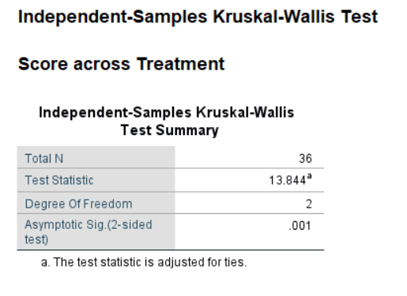
```


### SAS {#sasKWA}

```{r eval=F}
PROC npar1way data=work.KWanova ;
class Treatment;
var Score;
run;
```


```{r kwaSAS, echo=FALSE, fig.cap="\\label{fig:kwaSAS}SAS Output for Kruskal-Wallis ANOVA"}
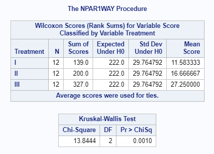
```


### Minitab {#minitabKWA}

```{r kwaMinitab, echo=FALSE, fig.cap="\\label{fig:kwaMinitab}Minitab Output for Kruskal-Wallis ANOVA"}
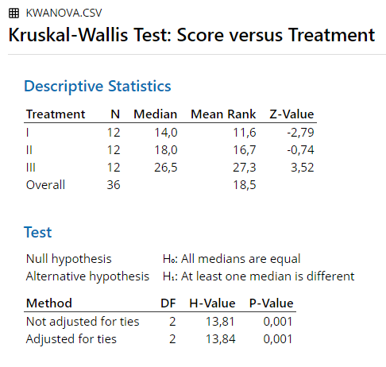
```


### R {#rKWA}
```{r echo=F}
KWA.data2 <- read.csv("Datasets/KWanova.csv", sep=",")
```


```{r}
kruskal.test(Score~Treatment, data = KWA.data2)
```


### Remarks {#remarksKWA}

All differences in results between the software and hand calculation are due to rounding.


### References {#refKWA}

Hays, W. L. (1974). *Statistics for the social sciences (2nd Ed.)*. New York, US: Holt, Rinehart and Winston, Inc.


## One-Way Repeated-Measures ANOVA

An example from Kerlinger (1969, pp. 242-248):

"A principal of a school and the members of his staff decided to introduce a program of education in intergroup relations as an addition to the school's curriculum. One of the problems that arose was in the use of motion pictures. Films were shown in the initial phases of the program, but the results were not too encouraging. [...} They decided to test the hypothesis that seeing the films and then discussing them would improve the viewers' attitudes toward minority group members more than would just seeing the films. For a preliminary study the staff randomly selected a group of students from the total student body and attempted to pair the students on intelligence and socioeconomic background until ten pairs were obtained [...] Each member of each pair was randomly assigned to either an experimental or a control group, and then both groups were shown a new film on intergroup relations. The A1 (experimental) group had a discission session after the picture was shown; the A2 (control) group had no such discussion afrer the film. Both groups were tested with a scale designed to measures attitudes toward minority groups."

```{r echo = F}
Ranova.data <- data.frame("A1(experimental)" = c(8,9,5,4,2,10,3,12,6,11), "A2(control)"=c(6,8,3,2,1,7,1,7,6,9))
knitr::kable(head(Ranova.data, 91), caption = "Data for One-Way Repeated-Measures ANOVA", booktabs = T)
```


### Results Overview {#ResultsRanova}

```{r echo=F}
ResultsRANOVA <- matrix(c(22.47, 22.50, 22.50, 22.50, 22.50, 22.50), ncol=6)
colnames(ResultsRANOVA) <- c('By Hand', 'JASP', 'SPSS', 'SAS', 'Minitab', 'R')
rownames(ResultsRANOVA) <- c('F')
knitr::kable(head(ResultsRANOVA, 20), caption = "Result Overview One-Way Repeated-Measures ANOVA", booktabs = T)
```

### By Hand {#ByHandRanova}

Calculations by hand can be found in Kerlinger, 1969, pp. 242-248.

Results: 

```{r echo = F}
Ranova.results.kerlinger <- data.frame(Source = c("Within groups", "Between groups", "Residual", "Totals"), df = c(1,9,9,19), SS = c(20,182,8,210), MS = c(20.00,20.22,0.89,NA), F = c(22.47, 22.72, NA, NA))
knitr::kable(head(Ranova.results.kerlinger, 20), caption = "Result from Kerlinger (1969)", booktabs = T)
```

**Conclusion:** All F-values are significant for $\alpha$ = .001 or less.


### JASP {#jaspRanova}

```{r ranovaJASP, echo=FALSE, fig.cap="\\label{fig:ranovaJASP}JASP Output for One-Way Repeated-Measures ANOVA"}
knitr::include_graphics('Screenshots/Repeated Measures ANOVA/ranovaJASP.PNG')
```

### SPSS {#spssRanova}
 
```{r eval=F}
DATASET ACTIVATE DataSet2.
GLM A1.experimental A2.control
  /WSFACTOR=Condition 2 Polynomial 
  /METHOD=SSTYPE(3)
  /CRITERIA=ALPHA(.05)
  /WSDESIGN=Condition.
```

```{r ranovaSPSS, echo=FALSE, fig.cap="\\label{fig:ranovaSPSS}SPSS Output for One-Way Repeated-Measures ANOVA"}
knitr::include_graphics('Screenshots/Repeated Measures ANOVA/ranovaSPSS.PNG')
```

### SAS {#sasRanova}

```{r eval=F}
PROC GLM DATA=work.ranova;
  CLASS Subject Condition;
  MODEL Score = Subject Condition;
RUN; 
```

```{r ranovaSAS, echo=FALSE, fig.cap="\\label{fig:ranovaSAS}SAS Output for One-Way Repeated-Measures ANOVA"}
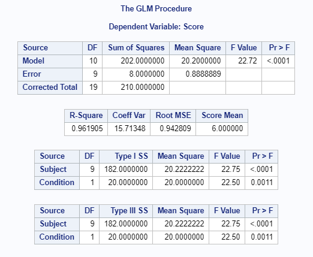
```

### Minitab {#minitabRanova}

```{r ranovaMinitab, echo=FALSE, fig.cap="\\label{fig:ranovaMinitab}Minitab Output for One-Way Repeated-Measures ANOVA"}
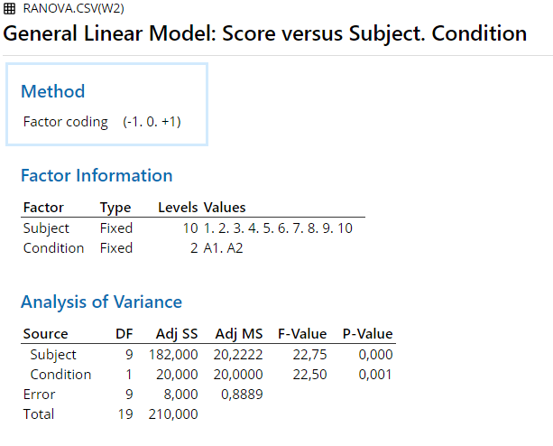
```

### R {#rRanova}

```{r echo=F}
ranova.data2 <- read.csv("Datasets/Ranova2.csv", sep=",")
```

```{r}
summary(aov(Score ~ as.factor(ranova.data2$Condition) + Error(as.factor(ranova.data2$Subject)/as.factor(ranova.data2$Condition)), data=ranova.data2))
```


### Remarks {#remarksRanova}


All differences in results between the software and hand calculation are due to rounding.


### References {#refRanova}

Kerlinger, F. N. (1969). *Foundations of behavioral research*. New York, US: Holt, Rinehart and Winston, Inc.


## Friedman Test 


An example from Hays (1974, pp. 785-786):

"For example, in an experiment with four experimental treatments (J = 4), 11 groups of 4 matched subjects apiece were used. Within each matched group the four subjects were assigned at random to the four treatments, on subject per treatment."

```{r echo=F}
Friedman.data <- data.frame("Groups" = c(1:11), "Treatment I" = c(1, 2, 10, 12, 1, 10, 4, 10, 10, 14, 3),
                       "Treatment II" = c(4,3,0,11,3,3,12,4,4,4,2), "Treatment III" = c(8,13,11,13,10,11,10,5,9,7,4),
                        "Treatment IV" = c(0,1,3,10,0,9,11,3,3,2,13))
knitr::kable(head(Friedman.data, 20), caption = "Data for Friedman Test", booktabs = T)
```

### Results Overview {#ResultsFriedman}

```{r echo=F}
ResultsFriedman <- matrix(c(11.79, 11.9455, 11.945, NA, 11.95, 11.945), ncol=6, byrow = T)
colnames(ResultsFriedman) <- c('By Hand', 'JASP', 'SPSS', 'SAS', 'Minitab', 'R')
rownames(ResultsFriedman) <- '$\\chi^2$'
knitr::kable(head(ResultsFriedman, 20), caption = "Result Overview Friedman Test", booktabs = T)
```

### By Hand {#ByHandFriedman}

Calculations by hand can be found in Hays, 1974, pp. 785-786.

Result: 

$\chi^2$ = 11.79

Significant for $\alpha$ = .01 or less.


### JASP {#jaspFriedman}


```{r FriedmanJASP, echo=FALSE, fig.cap="\\label{fig:FriedmanJASP}JASP Output for Friedman Test"}
knitr::include_graphics('Screenshots/Friedman Test/FriedmanJASP.PNG')
```


### SPSS {#spssFriedman}

```{r eval=F}
DATASET ACTIVATE DataSet1.
*Nonparametric Tests: Related Samples. 
NPTESTS 
  /RELATED TEST(Treatment.I Treatment.II Treatment.III Treatment.IV) FRIEDMAN(COMPARE=NONE) 
  /MISSING SCOPE=ANALYSIS USERMISSING=EXCLUDE
  /CRITERIA ALPHA=0.05  CILEVEL=95.

```


```{r FriedmanSPSS, echo=FALSE, fig.cap="\\label{fig:FriedmanSPSS}SPSS Output for Friedman Test"}
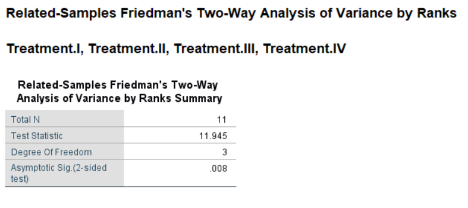
```


### SAS {#sasFriedman}

Not available in SAS.


### Minitab {#minitabFriedman}

```{r FriedmanMinitab, echo=FALSE, fig.cap="\\label{fig:FriedmanMinitab}Minitab Output for Friedman Test"}
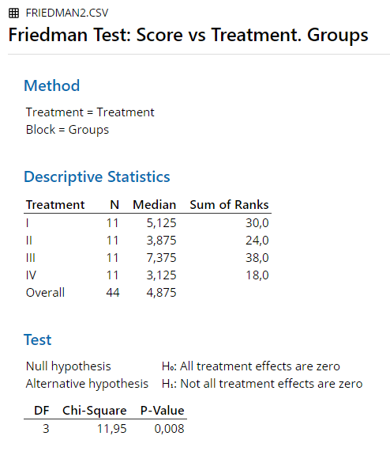
```


### R {#rFriedman}
```{r echo=F}
Friedman.data2 <- read.csv("Datasets/Friedman2.csv", sep=",")
```


```{r}
friedman.test(Friedman.data2$Score, groups = Friedman.data2$Treatment, blocks = Friedman.data2$Groups)
```


### Remarks {#remarksFriedman}

All differences in results between the software and hand calculation are due to rounding.


### References {#refFriedman}

Hays, W. L. (1974). *Statistics for the social sciences (2nd Ed.)*. New York, US: Holt, Rinehart and Winston, Inc.


## ANCOVA

An example from Field (2018 pp. 522-523, 576-577):

"Imagine we wanted to contribute to this literature by running a study in which we randomized people into three groups: (1) a control group [...]; (2) 15 minutes of puppy therapy (a low-dose group); and (3) 30 minutes of puppy contact (a high-dose group). The dependent variable was a measure of happiness ranging from 0 (as unhappy as I can possibly imagine being) to 10 (as happy as I can possibly imagine being). [...] The researchers [...] suddenly realized that a participant's love of dogs would affect whether puppy therapy would affect happiness. Therefore, they repeated the study on different participants, but included a self-report measure of love of puppies from 0 [...] to 7." 

```{r echo=F}
ANCOVA.data <- read.csv("Datasets/ANCOVA.csv", sep=",")
colnames(ANCOVA.data) <- c("Person", "Dose", "Happiness", "Puppy_love")
knitr::kable(head(ANCOVA.data, 20), caption = "Data for ANCOVA", booktabs = T)
```
### Results Overview {#ResultsANCOVA}

```{r echo=F}
ResultsANCOVA <- matrix(c(4.1419, 4.142, 4.14, 4.14, 4.1419,
                          4.9587, 4.959, 4.96, 4.96, 4.9587), ncol=5, byrow = T)
colnames(ResultsANCOVA) <- c('JASP', 'SPSS', 'SAS', 'Minitab', 'R')
rownames(ResultsANCOVA) <- c('F (Dose)', 'F (Puppy_love)')
knitr::kable(head(ResultsANCOVA, 20), caption = "Result Overview ANCOVA", booktabs = T)
```


### JASP {#jaspANCOVA}

```{r ancovaJASP, echo=FALSE, fig.cap="\\label{fig:ancovaJASP}JASP Output for ANCOVA"}
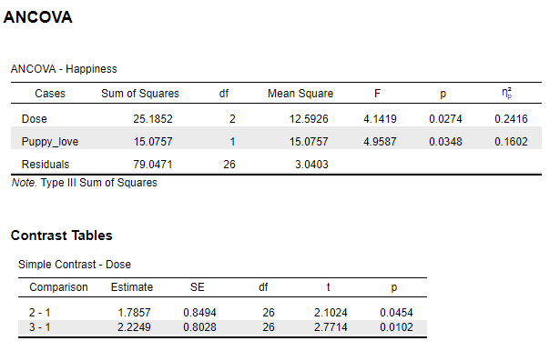
```

### SPSS {#spssANCOVA}

```{r eval=F}
UNIANOVA Happiness BY Dose WITH Puppy_love
  /CONTRAST(Dose)=Simple
  /METHOD=SSTYPE(3)
  /INTERCEPT=INCLUDE
  /PRINT ETASQ
  /CRITERIA=ALPHA(.05)
  /DESIGN=Puppy_love Dose.
```

```{r ancovaSPSS, echo=FALSE, fig.cap="\\label{fig:ancovaSPSS}SPSS Output for ANCOVA"}
knitr::include_graphics('Screenshots/ANCOVA/ancovaSPSS.PNG')
```

```{r ancovaSPSS2, echo=FALSE, fig.cap="\\label{fig:ancovaSPSS2}SPSS Output for ANCOVA Contrasts"}
knitr::include_graphics('Screenshots/ANCOVA/contrastsSPSS.PNG')
```
### SAS {#sasANCOVA}

```{r eval=F}
PROC GLM data=work.ANCOVA;
CLASS Dose;
MODEL Happiness = Dose Puppy_love / SOLUTION ss3;
LSMEANS Dose / STDERR PDIFF CL ADJUST = BON;
OUTPUT OUT = pred p=ybar r=resid;
RUN;
```

```{r ancovaSAS, echo=FALSE, fig.cap="\\label{fig:ancovaSAS}SAS Output for ANCOVA"}
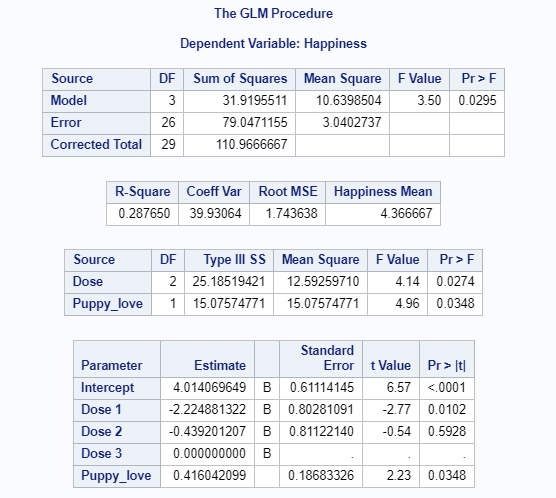
```


### Minitab {#minitabANCOVA}

```{r ancovaMinitab, echo=FALSE, fig.cap="\\label{fig:ancovaMinitab}Minitab Output for ANCOVA"}
knitr::include_graphics('Screenshots/ANCOVA/ancovaMinitab.PNG')
```


### R {#rANCOVA}

```{r echo=F}
ANCOVA.data <- read.csv("Datasets/ANCOVA.csv", sep=",")
colnames(ANCOVA.data) <- c("Person", "Dose", "Happiness", "Puppy_love")
```

```{r}
## install.packages("car")
library("car")
fit <- aov(Happiness~as.factor(Dose) + Puppy_love, data = ANCOVA.data)
Anova(fit, type = "III")
```
### Remarks {#remarksANCOVA}

All differences in results between the software are due to rounding.


### References {#refANCOVA}
Field, A. (2018). *Discovering statistics using IBM SPSS statistics*. Los Angeles, CA: SAGE.


## MANOVA 

An example from Field (2018 pp. 738-739):

"Most psychopathologies have both behavioural and cognitive elements to them. For example, for someone with OCD who has an obsession with germs and contamination, the disorder might manifest itself in the number of times they both wash their hands (behavior) and *think about* washing their hands (cognition). To gauge the success of therapy, it is not enough to look only at behavioural outcomes (such as whether obsessive behaviours are reduced); we need to look at whether cognitions are changed too. Hence, the clinical psychologist measured two outcomes: the occurrence of obsession-related behaviours (Actions) and the occurrence of obsession-related cognitions (Thoughts) on a single day."

```{r echo=F}
MANOVA.data <- read.csv("Datasets/MANOVA.csv", sep=",")
colnames(MANOVA.data) <- c("Group", "Actions", "Thoughts")
knitr::kable(head(MANOVA.data, 20), caption = "Data for MANOVA", booktabs = T)
```
### Results Overview {#ResultsMANOVA}

```{r echo=F}
ResultsMANOVA <- matrix(c(2.5567, 2.557, 2.56, 2.557, 2.5567,
                          2.7706, 2.771, 2.77, 2.77, 2.7706,
                          2.1541, 2.154, 2.15, 2.15, 2.1541), ncol=5, byrow = T)
colnames(ResultsMANOVA) <- c('JASP', 'SPSS', 'SAS', 'Minitab', 'R')
rownames(ResultsMANOVA) <- c('F (Multivariate Pillai)', 'F (Univariate Actions)', 'F (Univariate Thoughts)')
knitr::kable(head(ResultsMANOVA, 20), caption = "Result Overview MANOVA", booktabs = T)
```


### JASP {#jaspMANOVA}

```{r manovaJASP, echo=FALSE, fig.cap="\\label{fig:manovaJASP}JASP Output for MANOVA"}
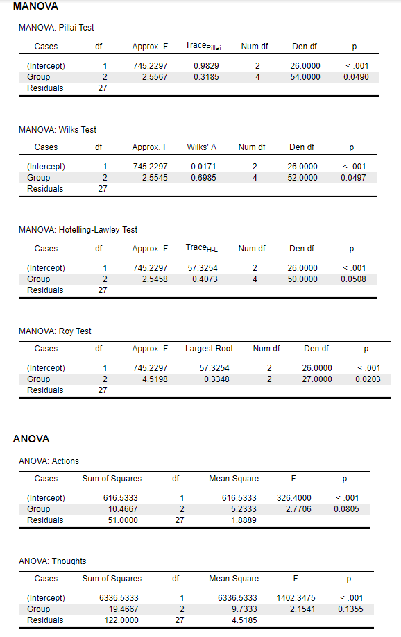
```

### SPSS {#spssMANOVA}

```{r eval=F}
DATASET ACTIVATE DataSet2.
GLM Actions Thoughts BY Group
  /METHOD=SSTYPE(3)
  /INTERCEPT=INCLUDE
  /CRITERIA=ALPHA(.05)
  /DESIGN= Group.

```

```{r manovaSPSS, echo=FALSE, fig.cap="\\label{fig:manovaSPSS}SPSS Output for MANOVA"}
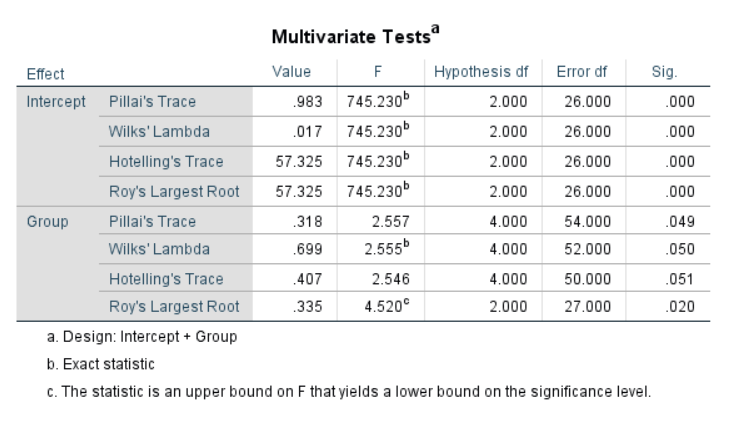
```

```{r manovaSPSS2, echo=FALSE, fig.cap="\\label{fig:manovaSPSS2}SPSS Output for MANOVA"}
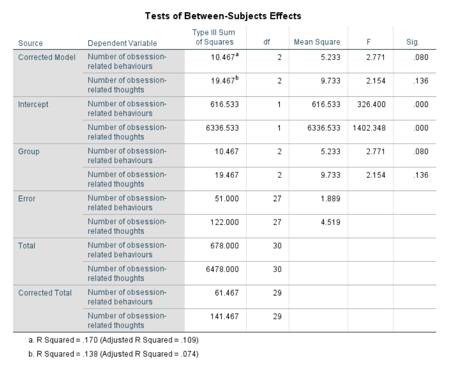
```
### SAS {#sasMANOVA}

```{r eval=F}
proc glm data= work.MANOVA plots=none;
  class Group;
  model Actions Thoughts = group / ss3;
  manova h=Group;
run;
```

```{r manovaSAS, echo=FALSE, fig.cap="\\label{fig:manovaSAS}SAS Output for MANOVA"}
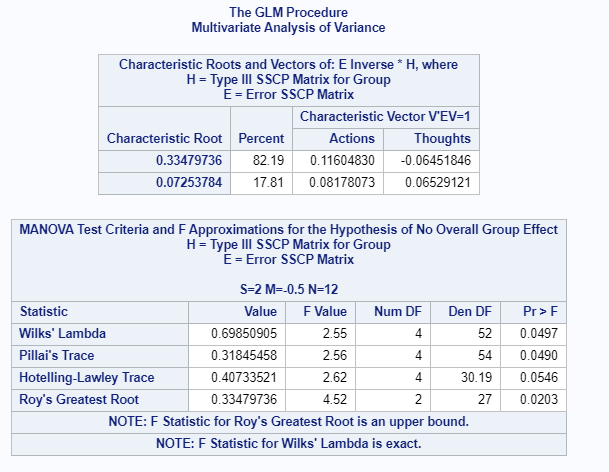
```

```{r manovaSAS2, echo=FALSE, fig.cap="\\label{fig:manovaSAS2}SAS Output for MANOVA"}
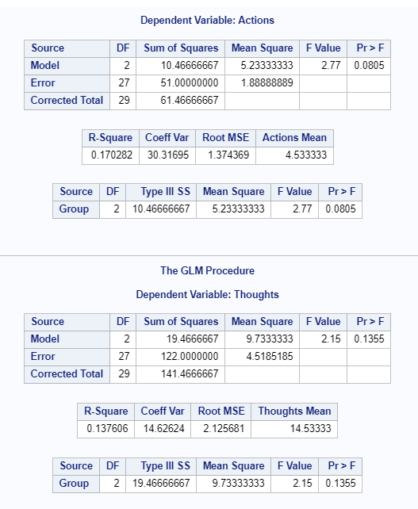
```

### Minitab {#minitabMANOVA}

```{r manovaMinitab, echo=FALSE, fig.cap="\\label{fig:manovaMinitab}Minitab Output for MANOVA"}
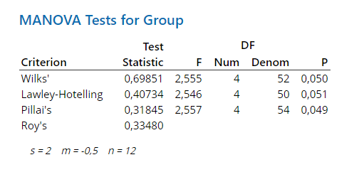
```

```{r manovaMinitab2, echo=FALSE, fig.cap="\\label{fig:manovaMinitab2}Minitab Output for MANOVA"}
knitr::include_graphics('Screenshots/MANOVA/ANOVASminitab.PNG')
```

### R {#rMANOVA}
```{r echo=F}
MANOVA.data <- read.csv("Datasets/MANOVA.csv", sep=",")
colnames(MANOVA.data) <- c("Group", "Actions", "Thoughts")
```

```{r}
DVmanova <- cbind(MANOVA.data$Thoughts, MANOVA.data$Actions)
fit <- manova(DVmanova ~ as.factor(Group), data = MANOVA.data)
summary(fit, test ="Pillai")
summary(fit, test ="Wilks")
summary(fit, test ="Hotelling-Lawley")
summary(fit, test ="Roy")
summary.aov(fit)
```
### Remarks {#remarksMANOVA}

All differences in results between the software are due to rounding.


### References {#refMANOVA}
Field, A. (2018). *Discovering statistics using IBM SPSS statistics*. Los Angeles, CA: SAGE.


