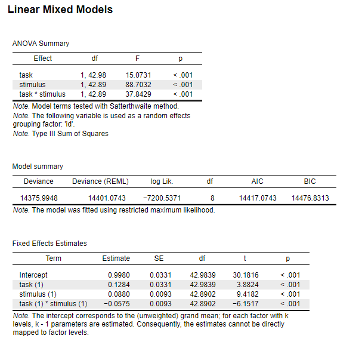
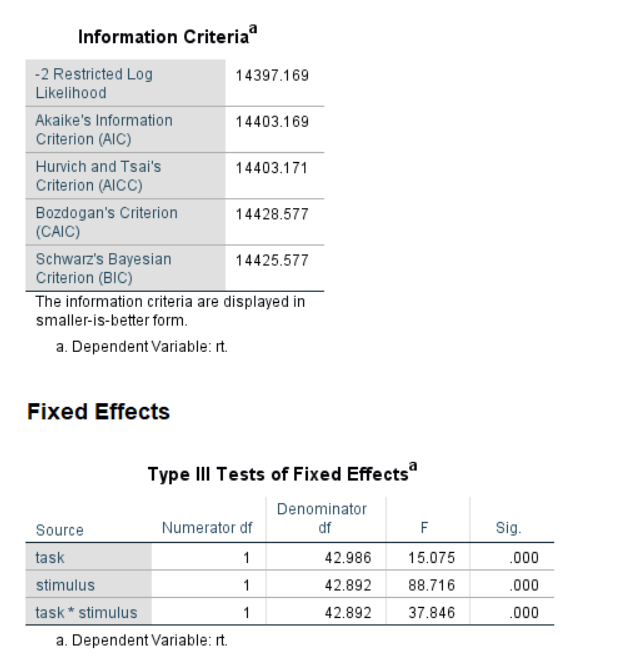
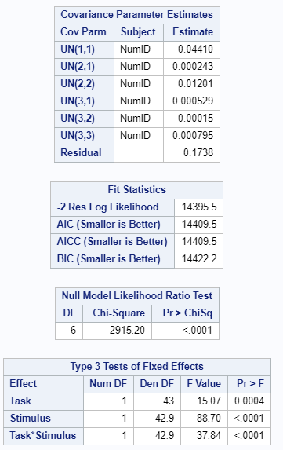

# Mixed Models

## Linear Mixed Models 

The example is based on data from an Experiment performed by Freeman, Heathcote, Chalmers, and Hockley (2010). In the example a simplified analysis of the data is performed, using only Task and Stimulus as fixed factors and stimulus by subject as random effect. 


### Results Overview {#ResultsLMM}

```{r echo=F}
ResultsLMM <- matrix(c(15.0731, 15.075, 15.07, 15.08, 15.07,
                          88.7032, 88.716, 88.70, 88.72, 88.70,
                          37.8429, 37.846, 37.84, 37.85, 37.84), ncol=5, byrow = T)
colnames(ResultsLMM) <- c('JASP', 'SPSS', 'SAS', 'Minitab', 'R')
rownames(ResultsLMM) <- c('F(Task)', 'F(Stimulus)', 'F(Task X Stimulus)')
knitr::kable(head(ResultsLMM, 20), caption = "Result Overview Linear Mixed Model", booktabs = T)
```


### JASP {#jaspLMM}

```{r lmmJASP, echo=FALSE, fig.cap="\\label{fig:lmmJASP}JASP Output for Linear Mixed Model"}

```

### SPSS {#spssLMM}

```{r eval=F}
DATASET ACTIVATE DataSet1.
MIXED rt BY task stimulus WITH NumID
  /CRITERIA=DFMETHOD(SATTERTHWAITE) CIN(95) MXITER(100) MXSTEP(10) SCORING(1) 
    SINGULAR(0.000000000001) HCONVERGE(0, ABSOLUTE) LCONVERGE(0, ABSOLUTE) PCONVERGE(0.000001, ABSOLUTE)    
  /FIXED=task stimulus task*stimulus | NOINT SSTYPE(3)
  /METHOD=REML
  /RANDOM=INTERCEPT stimulus | SUBJECT(NumID) COVTYPE(VC).
```

```{r lmmSPSS, echo=FALSE, fig.cap="\\label{fig:lmmSPSS}SPSS Output for Linear Mixed Model"}

```

### SAS {#sasLMM}

```{r eval=F}
proc mixed;
class Task Stimulus;
model rt = Task Stimulus Task*Stimulus / ddfm=satterth;
random intercept Stimulus / type=un subject=NumID g;
run;
```

```{r lmmSAS, echo=FALSE, fig.cap="\\label{fig:lmmSAS}SAS Output for Linear Mixed Model"}

```

### Minitab {#minitabLMM}

```{r lmmMinitab, echo=FALSE, fig.cap="\\label{fig:lmmMinitab}Minitab Output for Linear Mixed Model"}
knitr::include_graphics('Screenshots/Linear Mixed Model/lmmMinitab.PNG')
```


### R {#rLMM}

```{r echo=F}
LMM.data <- read.csv("Datasets/LMM.csv", sep=",")
```

```{r}
#install.packages("afex")
library("afex")
set_sum_contrasts() ## not strictly necessary
### but always a good idea
m1 <- mixed(rt ~ task*stimulus +
              (stimulus|id), data = LMM.data, method="S")
m1
```
### Remarks {#remarksLMM}

All differences in results between the software are due to rounding.


### References {#refLMM}

Freeman, E., Heathcote, A., Chalmers, K., & Hockley, W. (2010). Item effects in recognition memory for words. *Journal of Memory and Language, 62*(1), 1-18.
