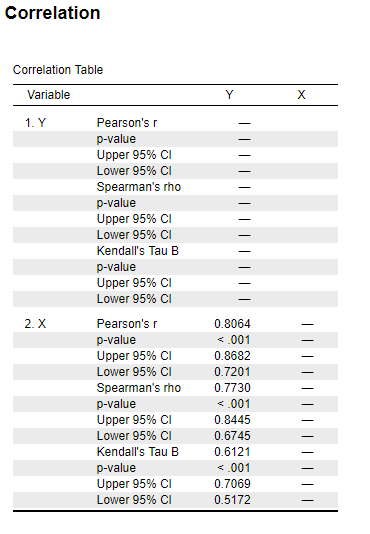
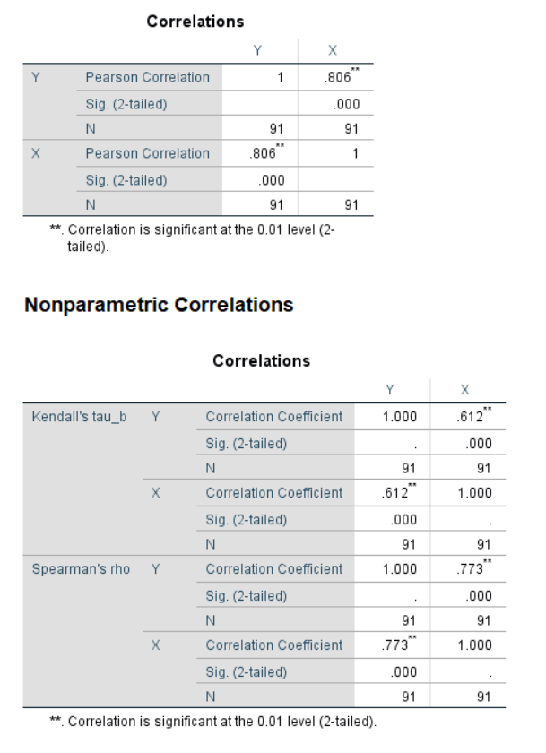
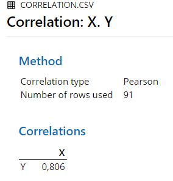
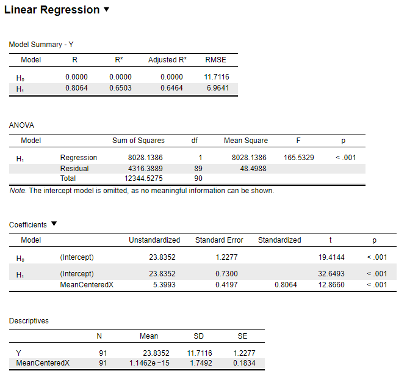
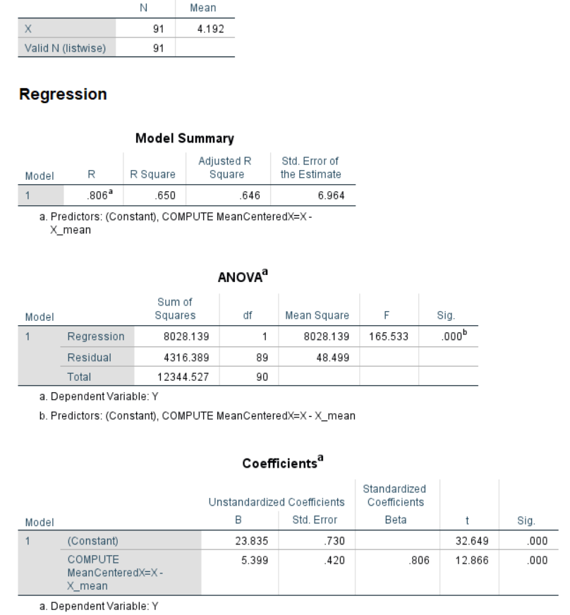
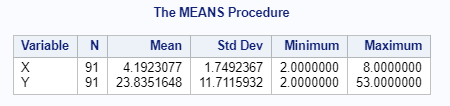
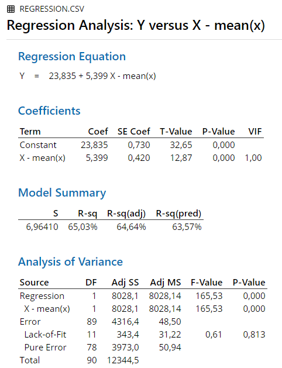

# Regression


## Correlation

An example from Hays (1974, pp. 633-635):

"The teacher collected data for a class of 91 students, obtaining for each a score *X*, based on the number of courses in high-school mathematics, and a score *Y*, the actual score on the final examination for the course."

```{r echo = F}
corr.data <- data.frame(X = c(rep(2, 10), rep(2.5, 11), rep(3, 10), rep(3.5, 14), rep(4, 15), rep(4.5, 3), rep(5, 4),
                   rep(5.5, 3), rep(6, 6), rep(6.5, 4), rep(7, 3), rep(7.5, 4), rep(8, 4)),
           Y = c(22, 17, 16, 14, 10, 9, 7, 5, 3, 2, 26, 23, 18, 18, 16, 13, 12, 10, 10, 7, 6,
                 29, 26, 26, 24, 24, 23, 22, 16, 9, 8, 34, 26, 25, 23, 23, 22, 22, 19, 18, 17, 17, 17,
                 12, 8, 36, 35, 30, 27, 25, 25, 24, 21, 20, 19, 19, 18, 18, 12, 3, 28, 27, 16, 41, 32,
                 27, 19, 32, 25, 25, 46, 38, 34, 33, 27, 20, 44, 37, 32, 28, 52, 46, 37, 42, 41, 38, 35
                 , 53, 48, 40, 40))
knitr::kable(head(corr.data, 91), caption = "Data for Correlation", booktabs = T)

```

### Results Overview {#ResultsCorr}

```{r echo=F}
ResultsCorrelation <- matrix(c(0.81, 0.8064, 0.806, 0.8064, 0.806, 0.8064,
                               NA, 0.7730, 0.773, 0.773, 0.773, 0.773,
                           NA, 0.6121, 0.612, 0.612, NA, 0.612), ncol=6, byrow = T)
colnames(ResultsCorrelation) <- c('By Hand', 'JASP', 'SPSS', 'SAS', 'Minitab', 'R')
rownames(ResultsCorrelation) <- c('Pearson', 'Spearman', 'Kendall')
knitr::kable(head(ResultsCorrelation, 20), caption = "Result Overview Correlation", booktabs = T)
```

### By Hand {#ByHandCorr}

Calculations by hand can be found in Hays, 1974, pp. 633-635.

Result: r = 0.81

**Note:** Hays calculated only the Pearson correlation coefficient.

### JASP {#jaspCorr}

```{r corrJASP, echo=FALSE, fig.cap="\\label{fig:corrJASP}JASP Output for Correlation"}

```
### SPSS {#spssCorr}

```{r eval = F}
DATASET ACTIVATE DataSet1.
CORRELATIONS
  /VARIABLES=Y X
  /PRINT=TWOTAIL NOSIG
  /MISSING=PAIRWISE.
NONPAR CORR
  /VARIABLES=Y X
  /PRINT=BOTH TWOTAIL NOSIG
  /MISSING=PAIRWISE.
```


```{r corrSPSS, echo=FALSE, fig.cap="\\label{fig:corrSPSS}SPSS Output for Correlation"}

```

### SAS {#sasCorr}

```{r eval = F}
PROC CORR DATA=Correlation pearson spearman kendall;
    VAR X;
    WITH Y;
RUN;
```

```{r corrSAS, echo=FALSE, fig.cap="\\label{fig:corrSAS}SAS Output for Correlation"}
knitr::include_graphics('Screenshots/Correlation/corrSAS.PNG')
```

### Minitab {#minitabCorr}
 
```{r corrMinitab, echo=FALSE, fig.cap="\\label{fig:corrMinitab}Minitab Output for Pearson Correlation"}

```

```{r corrMinitab2, echo=FALSE, fig.cap="\\label{fig:corrMinitab2}Minitab Output for Spearman Correlation"}
knitr::include_graphics('Screenshots/Correlation/corrMinitab2.PNG')
```

### R {#rCorr}

```{r}
cor.test(corr.data$X, corr.data$Y, method ="pearson")
cor.test(corr.data$X, corr.data$Y, method ="spearman")
cor.test(corr.data$X, corr.data$Y, method ="kendall")

```


### Remarks {#remarksCorr}

All differences in results between the software and hand calculation are due to rounding.


### References {#refCorr}

Hays, W. L. (1974). *Statistics for the social sciences (2nd Ed.)*. New York, US: Holt, Rinehart and Winston, Inc.


## Linear Regression

An example from Hays (1974, pp. 633-635):

"The teacher collected data for a class of 91 students, obtaining for each a score *X*, based on the number of courses in high-school mathematics, and a score *Y*, the actual score on the final examination for the course."

```{r echo = F}
regress.data <- data.frame(X = c(rep(2, 10), rep(2.5, 11), rep(3, 10), rep(3.5, 14), rep(4, 15), rep(4.5, 3), rep(5, 4),
                   rep(5.5, 3), rep(6, 6), rep(6.5, 4), rep(7, 3), rep(7.5, 4), rep(8, 4)),
           Y = c(22, 17, 16, 14, 10, 9, 7, 5, 3, 2, 26, 23, 18, 18, 16, 13, 12, 10, 10, 7, 6,
                 29, 26, 26, 24, 24, 23, 22, 16, 9, 8, 34, 26, 25, 23, 23, 22, 22, 19, 18, 17, 17, 17,
                 12, 8, 36, 35, 30, 27, 25, 25, 24, 21, 20, 19, 19, 18, 18, 12, 3, 28, 27, 16, 41, 32,
                 27, 19, 32, 25, 25, 46, 38, 34, 33, 27, 20, 44, 37, 32, 28, 52, 46, 37, 42, 41, 38, 35
                 , 53, 48, 40, 40))
knitr::kable(head(regress.data, 91), caption = "Data for Regression", booktabs = T)


```


### Results Overview {#ResultsReg}

```{r echo = F}
ResultsRegression <- matrix(c(23.84, 23.8352, 23.835, 23.8352, 23.835, 23.835,
                           5.42, 5.3993, 5.399, 5.3993, 5.399, 5.399,
                           4.19, 4.1923, 4.192, 4.1923, 4.192, 4.1923), ncol=6, byrow = T)
colnames(ResultsRegression) <- c('By Hand', 'JASP', 'SPSS', 'SAS', 'Minitab', 'R')
rownames(ResultsRegression) <- c('Constant', 'Regression Coefficient', '$\\overline{x}$')
knitr::kable(head(ResultsRegression, 18), caption = "Result Overview Independent Factorial ANOVA", booktabs = T)
```

### By Hand {#ByHandReg}
Calculations by hand can be found in Hays, 1974, pp. 633-635.

Results: 

y' = (5.42)(x - 4.19) + 23.84

**Note:** Hays mean-centered the equation by the mean of $\overline{x}$ = 4.19.

### JASP {#jaspReg}

```{r RegressionJASP, echo=FALSE, fig.cap="\\label{fig:RegressionJASP}JASP Output for Regression"}

```

```{r RegressionJASPmeans, echo=FALSE, fig.cap="\\label{fig:RegressionJASPmeans}JASP Output for Descriptives"}
knitr::include_graphics('Screenshots/Regression/RegressionJASPmeans.PNG')
```
**Mean-centered regression equation:**

y' = (5.3993)(x - 4.1923)  + 23.8352

### SPSS {#spssReg}

```{r eval=F}
DESCRIPTIVES VARIABLES=X
  /STATISTICS=MEAN.


REGRESSION
  /DESCRIPTIVES MEAN STDDEV CORR SIG N
  /MISSING LISTWISE
  /STATISTICS COEFF OUTS R ANOVA
  /CRITERIA=PIN(.05) POUT(.10)
  /NOORIGIN 
  /DEPENDENT Y
  /METHOD=ENTER MeanCenteredX.
  
```

```{r RegressionSPSS, echo=FALSE, fig.cap="\\label{fig:RegressionSPSS}SPSS Output for Regression"}

```

**Mean-centered regression equation:**

y' = (5.399)(x - 4.192)  + 23.835

### SAS {#sasReg}
```{r eval=F}
proc Reg data=Regression;
title "Linear regression";
model Y = MeanCenteredX;
run;
	
PROC MEANS DATA=Regression;
  VAR X Y;
RUN;
```


```{r RegressionSAS, echo=FALSE, fig.cap="\\label{fig:RegressionSAS}SAS Output for Regression"}
knitr::include_graphics('Screenshots/Regression/RegressionSAS.PNG')
```

```{r RegressionSASmeans, echo=FALSE, fig.cap="\\label{fig:RegressionSASmeans}SAS Output for Means"}

```

**Mean-centered regression equation:**

y' = (5.3993)(x - 4.1923077)  + 23.83516

### Minitab {#minitabReg}

```{r RegressionMinitab, echo=FALSE, fig.cap="\\label{fig:RegressionMinitab}Minitab Output for Regression"}

```

```{r RegressionMinitabmeans, echo=FALSE, fig.cap="\\label{fig:RegressionMinitabmeans}Minitab Output for Means"}
knitr::include_graphics('Screenshots/Regression/RegressionMinitabmeans.PNG')
```
**Mean-centered regression equation:**

y' = (5.399)(x - 4.192)  + 23.835

### R {#rReg}

```{r}
regress.data2 <- read.csv("Datasets/Regression.csv", sep=",")
lm(formula = Y ~ MeanCenteredX, data = regress.data2)
mean(regress.data2$X)
```
**Mean-centered regression equation:**

y' = (5.399)(x - 4.192308)  + 23.835

### Remarks {#remarksReg}


All differences in results between the software and hand calculation are due to rounding.


### References {#refReg}

Hays, W. L. (1974). *Statistics for the social sciences (2nd Ed.)*. New York, US: Holt, Rinehart and Winston, Inc.


## Logistic Regression

An example:

The Titanic-dataset contains original data of all passengers of the Titanic. It contains their name, their passenger class (1st - 3rd), their age, their sex, and whether or not they survived the sinking of the ship. The logistic regression model is computed to allow predictions on a passengers survival status, based on their age, sex, and passenger class.


### Results Overview {#ResultsLogreg}

```{r echo=F}
ResultsLogReg <- matrix(c( 3.7597, 3.760, 3.7596, 3.760, 3.7597 ,
                           -0.0392, -0.039, -0.0392, -0.0392,  -0.0392,
                           -1.2920, -1.292, -1.2920, -1.292, -1.2920,
                           -2.5214, -2.521, -2.5214, -2.521, -2.5214,
                           -2.6314, -2.631, -2.6313, -2.631, -2.6314), ncol=5, byrow = T)
colnames(ResultsLogReg) <- c('JASP', 'SPSS', 'SAS', 'Minitab', 'R')
rownames(ResultsLogReg) <- c('Constant', 'Age', '2nd Class', '3rd Class', 'Sex(Male)')
knitr::kable(head(ResultsLogReg, 20), caption = "Result Overview Coefficents Logistic Regression", booktabs = T)
```

```{r echo=F}
ResultsLogRegodds <- matrix(c( 42.9339, 42.934, NA, NA, 42.9339,
                                0.9616, 0.962, 0.962, 0.9616, 0.9616,
                                0.2747, 0.275, 0.275, 0.2747, 0.2747,
                                0.0803, 0.080, 0.080, 0.0803, 0.0803,
                                 0.0720, 0.072, 0.072, 0.0720, 0.0720), ncol=5, byrow = T)
colnames(ResultsLogRegodds) <- c('JASP', 'SPSS', 'SAS', 'Minitab', 'R')
rownames(ResultsLogRegodds) <- c('Constant', 'Age', '2nd Class', '3rd Class', 'Sex(Male)')
knitr::kable(head(ResultsLogRegodds, 20), caption = "Result Overview Odds-ratio Logistic Regression", booktabs = T)
```

**Note**: The reference case to which the odds ratios are refering is a female passenger in the first class with age 0.

### JASP {#jaspLogreg}

```{r LogRegJASP, echo=FALSE, fig.cap="\\label{fig:LogRegJASP}JASP Output for Logistic Regression"}
knitr::include_graphics('Screenshots/Logistic Regression/LogRegJASP.PNG')
```

### SPSS {#spssLogreg}

```{r eval=F}
DATASET ACTIVATE DataSet1.
LOGISTIC REGRESSION VARIABLES Survived
  /METHOD=ENTER PClass Age Sex 
  /CONTRAST (PClass)=Indicator(1)
  /CONTRAST (Sex)=Indicator(1)
  /CRITERIA=PIN(.05) POUT(.10) ITERATE(20) CUT(.5).

```

```{r LogRegSPSS, echo=FALSE, fig.cap="\\label{fig:LogRegSPSS}SPSS Output for Logistic Regression"}
knitr::include_graphics('Screenshots/Logistic Regression/LogRegSPSS.PNG')
```

### SAS {#sasLogreg}

```{r eval=F}
proc logistic data=work.LogReg DESC;
  class PClass Sex / param=reference ref=first;
  model Survived = Age Sex PClass; 
run;
```

```{r LogRegSAS, echo=FALSE, fig.cap="\\label{fig:LogRegSAS}SAS Output for Logistic Regression"}
knitr::include_graphics('Screenshots/Logistic Regression/LogRegSAS.PNG')
```

### Minitab {#minitabLogreg}

```{r LogRegMinitab, echo=FALSE, fig.cap="\\label{fig:LogRegMinitab}Minitab Output for Logistic Regression"}
knitr::include_graphics('Screenshots/Logistic Regression/LogRegMinitab.PNG')
```

### R {#rLogreg}

```{r echo=F}
LogReg.data2 <- read.csv("Datasets/LogReg.csv", sep=",")
```

```{r}
LogRegExample <- glm(factor(Survived) ~Age + factor(PClass) + factor(Sex), data=LogReg.data2, family=binomial(link="logit"))
summary(LogRegExample)
exp(coef(LogRegExample))
```
### Remarks {#remarksLogreg}

All differences in results between the software are due to rounding.

