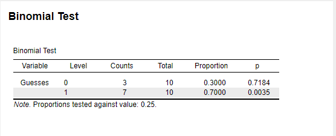
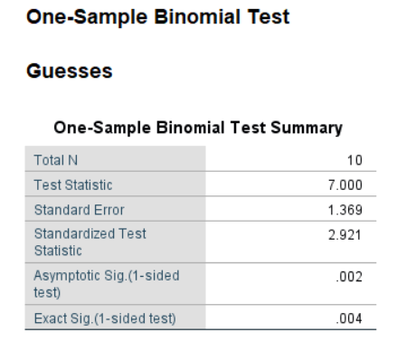
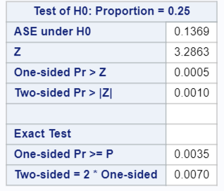
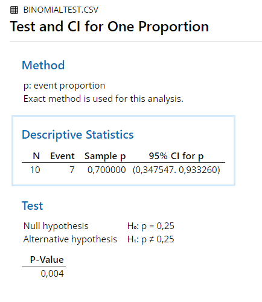
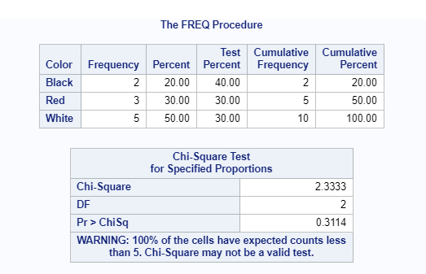
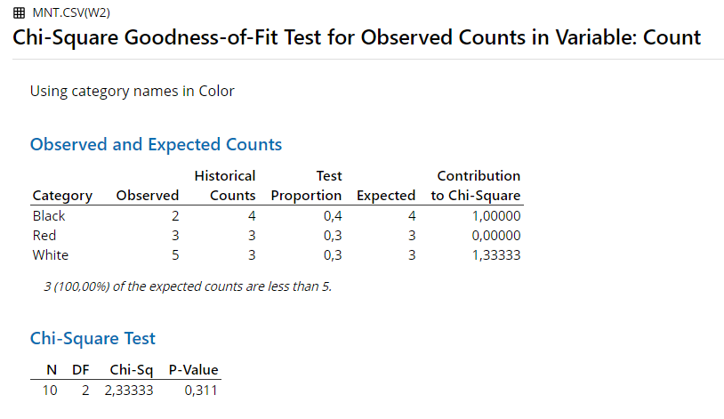
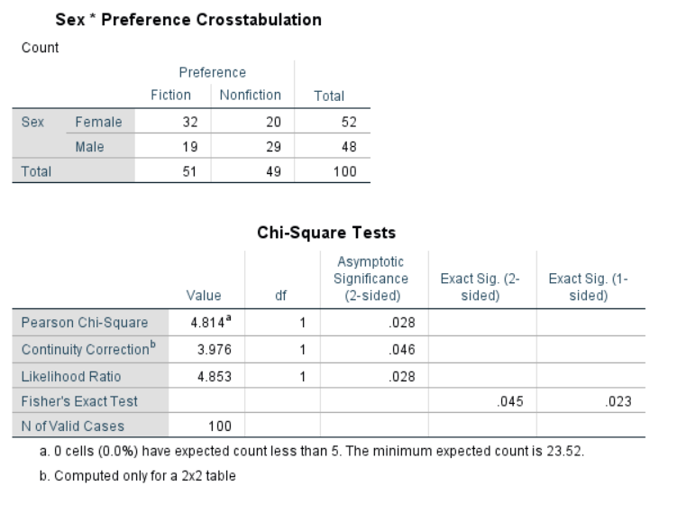
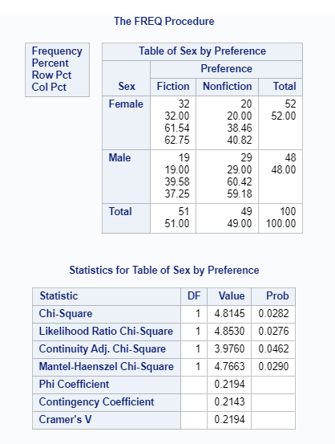
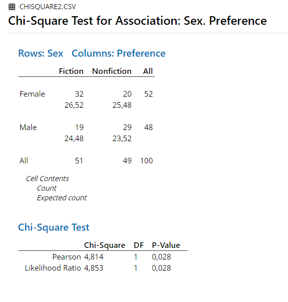

# Frequencies

## Binomial Test

### Example 
An example from Hays (1974, pp. 190-192): 


"Think of a hypothetical study of this question: 'If a human is subjected to a stimulus below his threshold of conscious awareness, can his behavior somehow still be influenced by the presence of the stimulus?' The experimental task is as follows: the subject is seated in a room in front of a square screen divided into four equal parts. He is instructed that his task is to guess in which part of the screen a small, very faint, spot of light is thrown." 


Under the null hypothesis H~0~, the number of correct guesses is expected to be 1/4 of the trials N. The alternative hypothesis H~1~ is that the number of correct guesses is larger than 1/4 of the trials N. 

The subject obtained 7 correct guesses T out of 10 trials N. 

What is the p-value of this result under H~0~?

p = 0.25 

N = 10

T = 7


### Results Overview {#ResultsBinom}

```{r echo=F}
ResultsBinomial <- matrix(c(0.0035,0.0035, 0.004, 0.0035, 0.004, 0.0035), ncol=6)
colnames(ResultsBinomial) <- c('By Hand', 'JASP', 'SPSS', 'SAS', 'Minitab', 'R')
rownames(ResultsBinomial) <- c('P')
knitr::kable(head(ResultsBinomial, 20), caption = "Result Overview Binomial Test", booktabs = T)
```


### By Hand {#ByHandBinom}

Calculations by hand can be found in Hays, 1974, pp. 190-192.

Result: P = 0.0035


### JASP {#jaspBinom}
```{r BinomialTestJASP, echo=FALSE, fig.cap="\\label{fig:BinomialTestJASP}JASP Output for Binomial Test"}

```


### SPSS {#spssBinom}

```{R eval=F}

DATASET NAME DataSet1 WINDOW=FRONT. 
*Nonparametric Tests: One Sample. 
NPTESTS 
  /ONESAMPLE TEST (Guesses) BINOMIAL(TESTVALUE=0.25 SUCCESSCATEGORICAL=FIRST SUCCESSCONTINUOUS=CUTPOINT(MIDPOINT)) 
  /MISSING SCOPE=ANALYSIS USERMISSING=EXCLUDE 
  /CRITERIA ALPHA=0.05 CILEVEL=95.

```


```{r BinomialTestSPSS, echo=FALSE, fig.cap="\\label{fig:BinomialTestSPSS}SPSS Output for Binomial Test"}

```

### SAS {#sasBinom}

```{R eval=F}

PROC Freq data=WORK.IMPORT;
	tables Guesses / binomial(p=.25 level=2);
	exact binomial;
run;

```


```{r BinomialTestSAS, echo=FALSE, fig.cap="\\label{fig:BinomialTestSAS}SAS Output for Binomial Test"}

```

### Minitab {#minitabBinom}


```{r BinomialTestMinitab, echo=FALSE, fig.cap="\\label{fig:BinomialTestMinitab}Minitab Output for Binomial Test"}

```

### R {#rBinom}

```{r}
binom.test(7, 10, p = 0.25, alternative = "greater")
```
 
### Remarks {#remarksBinom}

All differences in results between the software and hand calculation are due to rounding.


### References {#refBinom}

Hays, W. L. (1974). *Statistics for the social sciences (2nd Ed.)*. New York, US: Holt, Rinehart and Winston, Inc.


## Multinomial Test / Chi-square Goodness of Fit Test

### Example 
Think of colored marbles mixed together in a box, where the following probability distribution holds:

```{r echo=F}
Pdist <- data.frame('Color' = c('Black', 'Red', 'White'), "p" = c(0.40,0.30, 0.30))
knitr::kable(head(Pdist, 20), caption = "Probability Distribution for Multinomial Test Example", booktabs = T)
```

Now suppose that 10 marbles were drawn at random and with replacement. The samples shows 2 black, 3 red, and 5 white.

```{r echo=F}
MNsample <- data.frame('Color' = c('Black', 'Red', 'White'), "Count" = c(2,3,5), "Expected" = c(4,3,3))
knitr::kable(head(MNsample, 20), caption = "Sample for Multinomial Test Example", booktabs = T)
```


### Results Overview {#ResultsMultinom}

```{r echo=F}
ResultsMNT <- matrix(c(rep(2.333,5)), ncol=5, byrow = T)
colnames(ResultsMNT) <- c('JASP', 'SPSS', 'SAS', 'Minitab', 'R')
rownames(ResultsMNT) <- "$\\chi ^2$"
knitr::kable(head(ResultsMNT, 20), caption = "Result Overview Multinomial Test", booktabs = T)
```


### JASP {#jaspMultinom}


```{r mntJASP, echo=FALSE, fig.cap="\\label{fig:mntJASP}JASP Output for Multinomial Test"}
knitr::include_graphics('Screenshots/Multinomial Test/mntJASP.PNG')
```

### SPSS {#spssMultinom}

```{r eval=F}
DATASET ACTIVATE DataSet1.
NPAR TESTS
  /CHISQUARE=Numbered
  /EXPECTED=4 3 3
  /MISSING ANALYSIS.
```


```{r mntSPSS, echo=FALSE, fig.cap="\\label{fig:mntSPSS}SPSS Output for Multinomial Test"}
knitr::include_graphics('Screenshots/Multinomial Test/mntSPSS.PNG')
```

### SAS {#sasMultinom}

```{r eval=F}
PROC FREQ DATA = chisquared;
TABLES Sex*Preference / chisq;
run;
```


```{r mntSAS, echo=FALSE, fig.cap="\\label{fig:mntSAS}SAS Output for Multinomial Test"}

```

### Minitab {#minitabMultinom}

```{r mntMinitab, echo=FALSE, fig.cap="\\label{fig:mntMinitab}Minitab Output for Multinomial Test"}

```


### R {#rMultinom}


```{r}
chisq.test(MNsample$Count, p = Pdist$p)
```


### Remarks {#remarksMultinom}

All differences in results between the software are due to rounding.


## Chi-Squared-Test

An example from Hays (1974, pp. 728-731):

"For example, suppose that a random sample of 1-- school children is drawn. Each child is classified in two ways: the first attribute is the sex of the child, with two possible categories: [Male, Female].
The second attribute [...] is the stated preference of a child for two kinds of reading materials: [Fiction, Nonfiction]. [...] The data might, for example, turn out to be:"

```{r echo=F}
chiSquare.data <-matrix(c(19,32,29,20), ncol = 2, byrow = T)
colnames(chiSquare.data) <- c("Male", "Female")
rownames(chiSquare.data) <- c("Fiction", "Nonfiction")
knitr::kable(head(chiSquare.data, 20), caption = "Data for Chi-Squared-Test", booktabs = T)
```

### Results Overview {#ResultsChisquare}

```{r echo=F}
ResultsCST <- matrix(c(4.83, 4.8145, 4.814, 4.8145, 4.814, 4.8145), ncol=6, byrow = T)
colnames(ResultsCST) <- c('By Hand', 'JASP', 'SPSS', 'SAS', 'Minitab', 'R')
rownames(ResultsCST) <- "$\\chi ^2$"
knitr::kable(head(ResultsCST, 20), caption = "Result Overview Chi-Squared-Test", booktabs = T)
```

### By Hand {#ByHandChisquare}

Calculations by hand can be found in Hays, 1974, pp. 728-731.

Result: $\chi ^2$ = 4.83

Significant for $\alpha$ = .05 or less


### JASP {#jaspChisquare}


```{r cstJASP, echo=FALSE, fig.cap="\\label{fig:cstJASP}JASP Output for Chi-Squared-Test"}
knitr::include_graphics('Screenshots/Chi Squared/ChiSquaredJASP.PNG')
```

### SPSS {#spssChisquare}

```{r eval=F}
CROSSTABS
  /TABLES=Sex BY Preference
  /FORMAT=AVALUE TABLES
  /STATISTICS=CHISQ 
  /CELLS=COUNT 
  /COUNT ROUND CELL.

```


```{r cstSPSS, echo=FALSE, fig.cap="\\label{fig:cstSPSS}SPSS Output for Chi-Squared-Test"}

```

### SAS {#sasChisquare}

```{r eval=F}
PROC FREQ DATA = chisquared;
TABLES Sex*Preference / chisq;
run;
```


```{r cstSAS, echo=FALSE, fig.cap="\\label{fig:cstSAS}SAS Output for Chi-Squared-Test"}

```

### Minitab {#minitabChisquare}

```{r cstMinitab, echo=FALSE, fig.cap="\\label{fig:cstMinitab}Minitab Output for Chi-Squared-Test"}

```

### R {#rChisquare}
```{r echo=F}
chisquare.data2 <- read.csv("Datasets/chisquare2.csv", sep=",")
```


```{r}
chisq.test(chiSquare.data, correct = F)
```

### Remarks {#remarksChisquare}

All differences in results between the software and hand calculation are due to rounding.


### References {#refChisquare}

Hays, W. L. (1974). *Statistics for the social sciences (2nd Ed.)*. New York, US: Holt, Rinehart and Winston, Inc.


