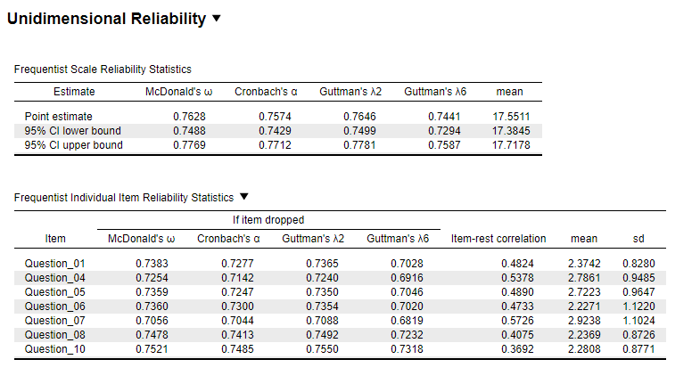
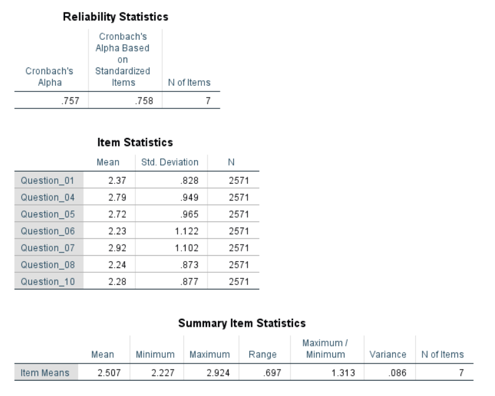
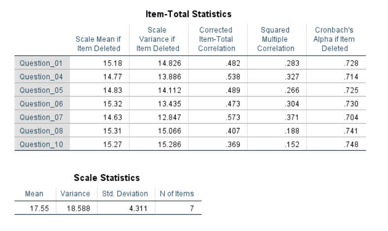
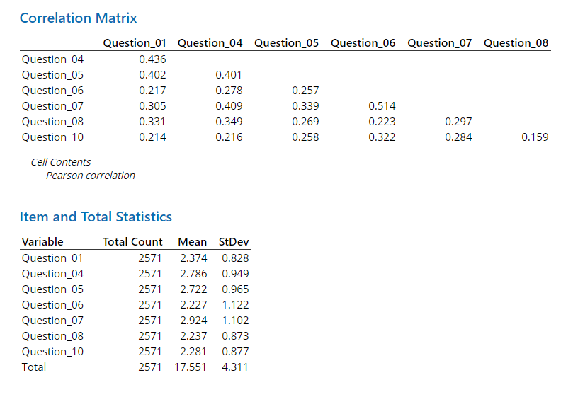
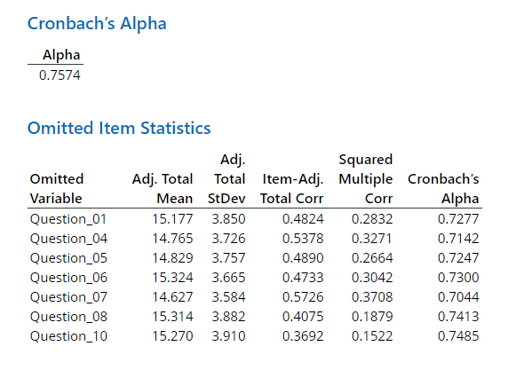

# Reliability Module

## Classical Single-Test Reliability Analysis

An example from Field (2018 pp. 795-796):

"I have noticed that a lot of students become very stressed about SPSS Statistics. Imagine that I wanted to design a questionnaire to measure a trait that I termed ‘SPSS anxiety’. I devised a questionnaire to measure various aspects of students’ anxiety towards learning SPSS, the SAQ. I generated questions based on interviews with anxious and non-anxious students and came up with 23 possible questions to include. Each question was a statement followed by a five-point Likert scale: ‘strongly disagree’, ‘disagree’, ‘neither agree nor disagree’, ‘agree’ and ‘strongly agree’ (SD, D, N, A and SA, respectively). What’s more, I wanted to know whether anxiety about SPSS could be broken down into specific forms of anxiety. In other words, what latent variables contribute to anxiety about SPSS? With a little help from a few lecturer friends I collected 2571 completed questionnaires."

**Note:** Only questions 1, 4, 5, 6, 7, 8, and 10 have been used to simplify the analysis.

### Results Overview {#ResultsReli}

```{r echo=F}
ResultsReli <- matrix(c(0.7574, 0.758, 0.7574, 0.7574, 0.7574),
                       ncol=5, byrow = T)
colnames(ResultsReli) <- c('JASP', 'SPSS', 'SAS', 'Minitab', 'R')
rownames(ResultsReli) <- c('Cronbachs $\\alpha$' )
knitr::kable(head(ResultsReli, 20), caption = "Result Overview Reliability Analysis", booktabs = T)
```
  
### JASP {#jaspReli}


```{r reliJASP, echo=FALSE, fig.cap="\\label{fig:reliJASP}JASP Output for Reliability Analysis"}

```


### SPSS {#spssReli}

```{r eval=F}
DATASET ACTIVATE DataSet1.
RELIABILITY
  /VARIABLES=Question_01 Question_04 Question_05 Question_06 Question_07 Question_08 Question_10
  /SCALE('ALL VARIABLES') ALL
  /MODEL=ALPHA
  /STATISTICS=DESCRIPTIVE SCALE
  /SUMMARY=TOTAL MEANS.
```


```{r reliSPSS, echo=FALSE, fig.cap="\\label{fig:reliSPSS}SPSS Output for Reliability Analysis"}

```

```{r reliSPSS2, echo=FALSE, fig.cap="\\label{fig:reliSPSS2}SPSS Output for Reliability Analysis"}

```

### SAS {#sasReli}

```{r eval=F}
PROC CORR DATA=work.Reliability ALPHA;
    VAR Q1 Q4 Q5 Q6 Q7 Q8 Q10;
RUN;
```


```{r reliSAS, echo=FALSE, fig.cap="\\label{fig:reliSAS}SAS Output for Reliability Analysis"}
knitr::include_graphics('Screenshots/Reliability/ReliabilitySAS.PNG')
```


### Minitab {#minitabReli}

```{r reliMinitab, echo=FALSE, fig.cap="\\label{fig:reliMinitab}Minitab Output for Reliability Analysis"}

```

```{r reliMinitab2, echo=FALSE, fig.cap="\\label{fig:reliMinitab2}Minitab Output for Reliability Analysis"}

```

### R {#rReli}
```{r echo=F}
reli.data <- read.csv("Datasets/Reliability.csv", sep=",")
```


```{r}
# library(psych)
QuestionSelection <- reli.data[c(1,4,5,6,7,8,10)]
analysis <- psych::alpha(QuestionSelection, cumulative = T)
analysis$total
analysis$item.stats
analysis$alpha.drop
analysis$total$raw_alpha
```


### Remarks {#remarksReli}

All differences in results between the software are due to rounding. For this analysis JASP 0.15 was used.


### References {#refReli}
Field, A. (2018). *Discovering statistics using IBM SPSS statistics*. Los Angeles, CA: SAGE.
